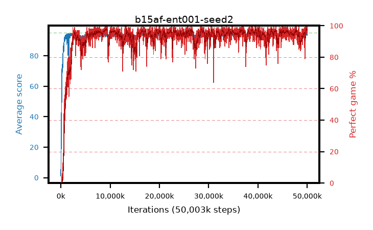

# b15af-ent001-seed2

step **50,003,968** · 3052 evals · trailing **94.36** · peak **94.45** @37,339,136 · sef **94.8** · best30 **97.7** @9,289,728

## Config

| | |
|---|---|
| algo | ppo |
| collect_envs | 128 |
| discount | 0.99 |
| eval_interval | 16384 |
| eval_queue | True |
| eval_queue_depth | 16 |
| eval_workers | 8 |
| fc_layers | (320,) |
| graph_eval_episodes | 100 |
| max_steps | 50003968 |
| min_checkpoint_score | 40.0 |
| ppo_adam_epsilon | 1e-07 |
| ppo_anneal_fraction | 1.0 |
| ppo_clip | 0.2 |
| ppo_clip_final | None |
| ppo_entropy_coef | 0.001 |
| ppo_entropy_coef_final | None |
| ppo_epochs | 4 |
| ppo_gae_lambda | 0.98 |
| ppo_gradient_clipping | 0.5 |
| ppo_horizon | 33.6 |
| ppo_learning_rate | 0.0003 |
| ppo_learning_rate_final | None |
| ppo_minibatch | 256 |
| ppo_normalize_adv | True |
| ppo_rollout | 128 |
| ppo_target_kl | 0.0 |
| ppo_transitions_per_rollout | 16384 |
| ppo_value_loss | huber |
| ppo_vf_coef | 0.5 |
| seed | 2 |
| torch_threads | 1 |

## Evals

| step | avg score | trailing avg | min score | max score | avg reward | perfect % | epsilon |
|---|---|---|---|---|---|---|---|
| 16384 | 1.17 | 1.17 | 0.0 | 5.0 | -0.905 | 0.0 |  |
| 32768 | 8.23 | 4.7 | 0.0 | 23.0 | 3.86 | 0.0 |  |
| 49152 | 23.88 | 11.09 | 6.0 | 45.0 | 18.88 | 0.0 |  |
| ... | ... | ... | ... | ... | ... | ... | ... |
| 49823744 | 93.71 | 94.06 | 48.0 | 95.0 | 187.735 | 95.0 |  |
| 49840128 | 94.7 | 94.17 | 70.0 | 95.0 | 191.71 | 98.0 |  |
| 49856512 | 94.58 | 94.12 | 70.0 | 95.0 | 190.55 | 97.0 |  |
| 49872896 | 93.62 | 94.11 | 24.0 | 95.0 | 187.645 | 95.0 |  |
| 49889280 | 94.58 | 94.08 | 53.0 | 95.0 | 192.54 | 99.0 |  |
| 49905664 | 94.71 | 94.06 | 66.0 | 95.0 | 192.715 | 99.0 |  |
| 49922048 | 94.49 | 94.22 | 67.0 | 95.0 | 190.505 | 97.0 |  |
| 49938432 | 94.74 | 94.11 | 69.0 | 95.0 | 192.745 | 99.0 |  |
| 49954816 | 94.33 | 94.16 | 67.0 | 95.0 | 189.305 | 96.0 |  |
| 49971200 | 94.46 | 94.23 | 63.0 | 95.0 | 190.475 | 97.0 |  |
| 49987584 | 93.42 | 94.18 | 22.0 | 95.0 | 189.435 | 97.0 |  |
| 50003968 | 94.87 | 94.36 | 82.0 | 95.0 | 192.875 | 99.0 |  |
