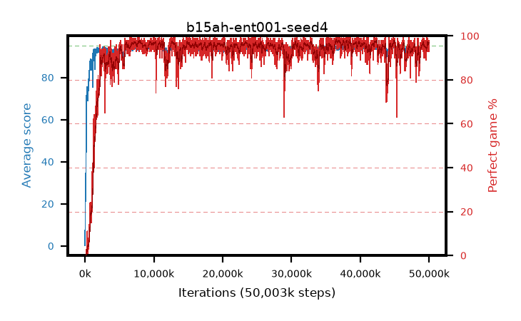

# b15ah-ent001-seed4

step **50,003,968** · 3052 evals · trailing **94.13** · peak **94.4** @8,208,384 · sef **94.9** · best30 **97.8** @36,732,928

## Config

| | |
|---|---|
| algo | ppo |
| collect_envs | 128 |
| discount | 0.99 |
| eval_interval | 16384 |
| eval_queue | True |
| eval_queue_depth | 16 |
| eval_workers | 8 |
| fc_layers | (320,) |
| graph_eval_episodes | 100 |
| max_steps | 50003968 |
| min_checkpoint_score | 40.0 |
| ppo_adam_epsilon | 1e-07 |
| ppo_anneal_fraction | 1.0 |
| ppo_clip | 0.2 |
| ppo_clip_final | None |
| ppo_entropy_coef | 0.001 |
| ppo_entropy_coef_final | None |
| ppo_epochs | 4 |
| ppo_gae_lambda | 0.98 |
| ppo_gradient_clipping | 0.5 |
| ppo_horizon | 33.6 |
| ppo_learning_rate | 0.0003 |
| ppo_learning_rate_final | None |
| ppo_minibatch | 256 |
| ppo_normalize_adv | True |
| ppo_rollout | 128 |
| ppo_target_kl | 0.0 |
| ppo_transitions_per_rollout | 16384 |
| ppo_value_loss | huber |
| ppo_vf_coef | 0.5 |
| seed | 4 |
| torch_threads | 1 |

## Evals

| step | avg score | trailing avg | min score | max score | avg reward | perfect % | epsilon |
|---|---|---|---|---|---|---|---|
| 16384 | 0.21 | 0.21 | 0.0 | 2.0 | -0.605 | 0.0 |  |
| 32768 | 17.16 | 17.14 | 2.0 | 33.0 | 12.7 | 0.0 |  |
| 49152 | 25.28 | 12.75 | 9.0 | 44.0 | 20.28 | 0.0 |  |
| ... | ... | ... | ... | ... | ... | ... | ... |
| 49823744 | 93.51 | 93.92 | 23.0 | 95.0 | 186.45 | 94.0 |  |
| 49840128 | 94.47 | 94.04 | 68.0 | 95.0 | 190.485 | 97.0 |  |
| 49856512 | 94.7 | 93.97 | 71.0 | 95.0 | 191.71 | 98.0 |  |
| 49872896 | 94.7 | 93.96 | 68.0 | 95.0 | 191.71 | 98.0 |  |
| 49889280 | 94.38 | 94.0 | 72.0 | 95.0 | 190.395 | 97.0 |  |
| 49905664 | 94.78 | 94.1 | 75.0 | 95.0 | 191.79 | 98.0 |  |
| 49922048 | 94.18 | 94.05 | 23.0 | 95.0 | 189.155 | 96.0 |  |
| 49938432 | 94.64 | 94.02 | 65.0 | 95.0 | 191.65 | 98.0 |  |
| 49954816 | 94.74 | 94.04 | 81.0 | 95.0 | 191.75 | 98.0 |  |
| 49971200 | 94.2 | 94.12 | 60.0 | 95.0 | 189.22 | 96.0 |  |
| 49987584 | 93.02 | 94.12 | 28.0 | 95.0 | 185.055 | 93.0 |  |
| 50003968 | 94.14 | 94.13 | 43.0 | 95.0 | 189.115 | 96.0 |  |
