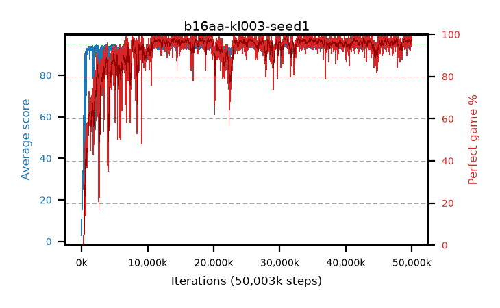

# b16aa-kl003-seed1

step **50,003,968** · 3052 evals · trailing **94.38** · peak **94.51** @30,752,768 · sef **91.7** · best30 **98.0** @30,998,528

## Config

| | |
|---|---|
| algo | ppo |
| collect_envs | 128 |
| discount | 0.99 |
| eval_interval | 16384 |
| eval_queue | True |
| eval_queue_depth | 16 |
| eval_workers | 8 |
| fc_layers | (320,) |
| graph_eval_episodes | 100 |
| max_steps | 50003968 |
| min_checkpoint_score | 40.0 |
| ppo_adam_epsilon | 1e-07 |
| ppo_anneal_fraction | 1.0 |
| ppo_clip | 0.2 |
| ppo_clip_final | None |
| ppo_entropy_coef | 0.01 |
| ppo_entropy_coef_final | None |
| ppo_epochs | 4 |
| ppo_gae_lambda | 0.98 |
| ppo_gradient_clipping | 0.5 |
| ppo_horizon | 33.6 |
| ppo_learning_rate | 0.0003 |
| ppo_learning_rate_final | None |
| ppo_minibatch | 256 |
| ppo_normalize_adv | True |
| ppo_rollout | 128 |
| ppo_target_kl | 0.003 |
| ppo_transitions_per_rollout | 16384 |
| ppo_value_loss | huber |
| ppo_vf_coef | 0.5 |
| seed | 1 |
| torch_threads | 1 |

## Evals

| step | avg score | trailing avg | min score | max score | avg reward | perfect % | epsilon |
|---|---|---|---|---|---|---|---|
| 16384 | 2.85 | 2.85 | 0.0 | 10.0 | 2.35 | 0.0 |  |
| 32768 | 15.95 | 12.47 | 2.0 | 30.0 | 10.95 | 0.0 |  |
| 49152 | 15.27 | 9.06 | 2.0 | 29.0 | 10.27 | 0.0 |  |
| ... | ... | ... | ... | ... | ... | ... | ... |
| 49823744 | 94.93 | 94.3 | 88.0 | 95.0 | 192.935 | 99.0 |  |
| 49840128 | 94.55 | 94.25 | 71.0 | 95.0 | 191.56 | 98.0 |  |
| 49856512 | 95.0 | 94.27 | 95.0 | 95.0 | 194.0 | 100.0 |  |
| 49872896 | 94.39 | 94.33 | 66.0 | 95.0 | 190.36 | 97.0 |  |
| 49889280 | 93.91 | 94.41 | 57.0 | 95.0 | 187.89 | 95.0 |  |
| 49905664 | 94.51 | 94.39 | 56.0 | 95.0 | 190.525 | 97.0 |  |
| 49922048 | 94.87 | 94.42 | 82.0 | 95.0 | 192.83 | 99.0 |  |
| 49938432 | 94.11 | 94.33 | 12.0 | 95.0 | 190.125 | 97.0 |  |
| 49954816 | 94.42 | 94.36 | 59.0 | 95.0 | 191.43 | 98.0 |  |
| 49971200 | 94.15 | 94.36 | 55.0 | 95.0 | 189.17 | 96.0 |  |
| 49987584 | 93.78 | 94.36 | 8.0 | 95.0 | 189.795 | 97.0 |  |
| 50003968 | 93.71 | 94.38 | 14.0 | 95.0 | 187.735 | 95.0 |  |
