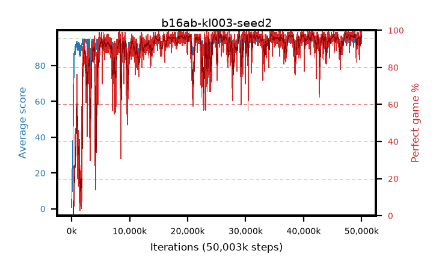

# b16ab-kl003-seed2

step **50,003,968** · 3052 evals · trailing **94.1** · peak **94.49** @41,762,816 · sef **89.1** · best30 **97.6** @41,730,048

## Config

| | |
|---|---|
| algo | ppo |
| collect_envs | 128 |
| discount | 0.99 |
| eval_interval | 16384 |
| eval_queue | True |
| eval_queue_depth | 16 |
| eval_workers | 8 |
| fc_layers | (320,) |
| graph_eval_episodes | 100 |
| max_steps | 50003968 |
| min_checkpoint_score | 40.0 |
| ppo_adam_epsilon | 1e-07 |
| ppo_anneal_fraction | 1.0 |
| ppo_clip | 0.2 |
| ppo_clip_final | None |
| ppo_entropy_coef | 0.01 |
| ppo_entropy_coef_final | None |
| ppo_epochs | 4 |
| ppo_gae_lambda | 0.98 |
| ppo_gradient_clipping | 0.5 |
| ppo_horizon | 33.6 |
| ppo_learning_rate | 0.0003 |
| ppo_learning_rate_final | None |
| ppo_minibatch | 256 |
| ppo_normalize_adv | True |
| ppo_rollout | 128 |
| ppo_target_kl | 0.003 |
| ppo_transitions_per_rollout | 16384 |
| ppo_value_loss | huber |
| ppo_vf_coef | 0.5 |
| seed | 2 |
| torch_threads | 1 |

## Evals

| step | avg score | trailing avg | min score | max score | avg reward | perfect % | epsilon |
|---|---|---|---|---|---|---|---|
| 16384 | 0.91 | 0.91 | 0.0 | 5.0 | 0.005 | 0.0 |  |
| 32768 | 8.43 | 4.67 | 2.0 | 21.0 | 3.43 | 0.0 |  |
| 49152 | 10.31 | 6.55 | 2.0 | 18.0 | 5.31 | 0.0 |  |
| ... | ... | ... | ... | ... | ... | ... | ... |
| 49823744 | 94.87 | 94.21 | 86.0 | 95.0 | 191.88 | 98.0 |  |
| 49840128 | 93.94 | 94.19 | 18.0 | 95.0 | 190.95 | 98.0 |  |
| 49856512 | 94.19 | 94.18 | 52.0 | 95.0 | 191.2 | 98.0 |  |
| 49872896 | 93.69 | 94.21 | 61.0 | 95.0 | 187.715 | 95.0 |  |
| 49889280 | 94.27 | 94.18 | 61.0 | 95.0 | 190.285 | 97.0 |  |
| 49905664 | 93.47 | 94.11 | 32.0 | 95.0 | 188.49 | 96.0 |  |
| 49922048 | 94.33 | 94.12 | 62.0 | 95.0 | 190.345 | 97.0 |  |
| 49938432 | 94.25 | 94.13 | 60.0 | 95.0 | 190.265 | 97.0 |  |
| 49954816 | 94.43 | 94.13 | 69.0 | 95.0 | 189.45 | 96.0 |  |
| 49971200 | 94.21 | 94.19 | 74.0 | 95.0 | 186.245 | 93.0 |  |
| 49987584 | 93.84 | 94.11 | 41.0 | 95.0 | 188.815 | 96.0 |  |
| 50003968 | 94.74 | 94.1 | 69.0 | 95.0 | 192.745 | 99.0 |  |
