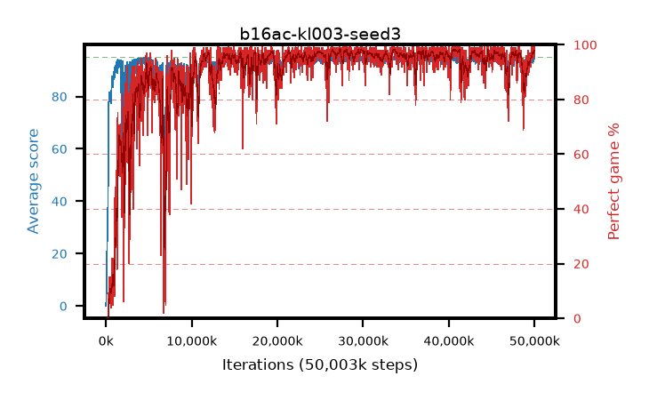

# b16ac-kl003-seed3

step **50,003,968** · 3052 evals · trailing **94.2** · peak **94.59** @33,849,344 · sef **89.1** · best30 **98.2** @40,861,696

## Config

| | |
|---|---|
| algo | ppo |
| collect_envs | 128 |
| discount | 0.99 |
| eval_interval | 16384 |
| eval_queue | True |
| eval_queue_depth | 16 |
| eval_workers | 8 |
| fc_layers | (320,) |
| graph_eval_episodes | 100 |
| max_steps | 50003968 |
| min_checkpoint_score | 40.0 |
| ppo_adam_epsilon | 1e-07 |
| ppo_anneal_fraction | 1.0 |
| ppo_clip | 0.2 |
| ppo_clip_final | None |
| ppo_entropy_coef | 0.01 |
| ppo_entropy_coef_final | None |
| ppo_epochs | 4 |
| ppo_gae_lambda | 0.98 |
| ppo_gradient_clipping | 0.5 |
| ppo_horizon | 33.6 |
| ppo_learning_rate | 0.0003 |
| ppo_learning_rate_final | None |
| ppo_minibatch | 256 |
| ppo_normalize_adv | True |
| ppo_rollout | 128 |
| ppo_target_kl | 0.003 |
| ppo_transitions_per_rollout | 16384 |
| ppo_value_loss | huber |
| ppo_vf_coef | 0.5 |
| seed | 3 |
| torch_threads | 1 |

## Evals

| step | avg score | trailing avg | min score | max score | avg reward | perfect % | epsilon |
|---|---|---|---|---|---|---|---|
| 16384 | 0.05 | 0.05 | 0.0 | 1.0 | -0.45 | 0.0 |  |
| 32768 | 1.92 | 3.07 | 0.0 | 5.0 | -1.37 | 0.0 |  |
| 49152 | 7.24 | 3.65 | 2.0 | 17.0 | 2.24 | 0.0 |  |
| ... | ... | ... | ... | ... | ... | ... | ... |
| 49823744 | 93.18 | 94.18 | 10.0 | 95.0 | 187.205 | 95.0 |  |
| 49840128 | 94.31 | 94.18 | 26.0 | 95.0 | 192.315 | 99.0 |  |
| 49856512 | 93.7 | 94.18 | 28.0 | 95.0 | 189.67 | 97.0 |  |
| 49872896 | 94.61 | 94.2 | 75.0 | 95.0 | 191.575 | 98.0 |  |
| 49889280 | 94.31 | 94.13 | 28.0 | 95.0 | 191.275 | 98.0 |  |
| 49905664 | 94.86 | 94.2 | 81.0 | 95.0 | 192.865 | 99.0 |  |
| 49922048 | 94.92 | 94.21 | 87.0 | 95.0 | 192.925 | 99.0 |  |
| 49938432 | 94.5 | 94.22 | 74.0 | 95.0 | 189.52 | 96.0 |  |
| 49954816 | 94.91 | 94.33 | 86.0 | 95.0 | 192.915 | 99.0 |  |
| 49971200 | 94.6 | 94.24 | 64.0 | 95.0 | 191.61 | 98.0 |  |
| 49987584 | 94.62 | 94.21 | 69.0 | 95.0 | 189.595 | 96.0 |  |
| 50003968 | 95.0 | 94.2 | 95.0 | 95.0 | 194.0 | 100.0 |  |
