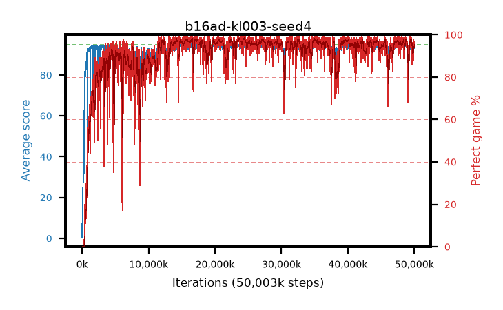

# b16ad-kl003-seed4

step **50,003,968** · 3052 evals · trailing **93.81** · peak **94.5** @24,543,232 · sef **90.3** · best30 **97.8** @24,592,384

## Config

| | |
|---|---|
| algo | ppo |
| collect_envs | 128 |
| discount | 0.99 |
| eval_interval | 16384 |
| eval_queue | True |
| eval_queue_depth | 16 |
| eval_workers | 8 |
| fc_layers | (320,) |
| graph_eval_episodes | 100 |
| max_steps | 50003968 |
| min_checkpoint_score | 40.0 |
| ppo_adam_epsilon | 1e-07 |
| ppo_anneal_fraction | 1.0 |
| ppo_clip | 0.2 |
| ppo_clip_final | None |
| ppo_entropy_coef | 0.01 |
| ppo_entropy_coef_final | None |
| ppo_epochs | 4 |
| ppo_gae_lambda | 0.98 |
| ppo_gradient_clipping | 0.5 |
| ppo_horizon | 33.6 |
| ppo_learning_rate | 0.0003 |
| ppo_learning_rate_final | None |
| ppo_minibatch | 256 |
| ppo_normalize_adv | True |
| ppo_rollout | 128 |
| ppo_target_kl | 0.003 |
| ppo_transitions_per_rollout | 16384 |
| ppo_value_loss | huber |
| ppo_vf_coef | 0.5 |
| seed | 4 |
| torch_threads | 1 |

## Evals

| step | avg score | trailing avg | min score | max score | avg reward | perfect % | epsilon |
|---|---|---|---|---|---|---|---|
| 16384 | 0.63 | 0.63 | 0.0 | 6.0 | 0.13 | 0.0 |  |
| 32768 | 12.46 | 6.55 | 1.0 | 26.0 | 7.46 | 0.0 |  |
| 49152 | 14.69 | 9.26 | 2.0 | 33.0 | 9.69 | 0.0 |  |
| ... | ... | ... | ... | ... | ... | ... | ... |
| 49823744 | 91.91 | 94.04 | 8.0 | 95.0 | 183.945 | 93.0 |  |
| 49840128 | 93.37 | 93.96 | 70.0 | 95.0 | 180.385 | 88.0 |  |
| 49856512 | 93.01 | 93.92 | 12.0 | 95.0 | 185.045 | 93.0 |  |
| 49872896 | 94.87 | 93.89 | 87.0 | 95.0 | 191.88 | 98.0 |  |
| 49889280 | 94.38 | 93.88 | 67.0 | 95.0 | 188.405 | 95.0 |  |
| 49905664 | 94.67 | 93.89 | 86.0 | 95.0 | 187.7 | 94.0 |  |
| 49922048 | 93.93 | 93.84 | 67.0 | 95.0 | 186.96 | 94.0 |  |
| 49938432 | 94.61 | 93.92 | 78.0 | 95.0 | 189.63 | 96.0 |  |
| 49954816 | 94.5 | 93.89 | 76.0 | 95.0 | 190.515 | 97.0 |  |
| 49971200 | 93.91 | 93.9 | 18.0 | 95.0 | 186.895 | 94.0 |  |
| 49987584 | 93.12 | 93.91 | 16.0 | 95.0 | 189.135 | 97.0 |  |
| 50003968 | 93.25 | 93.81 | 20.0 | 95.0 | 187.275 | 95.0 |  |
