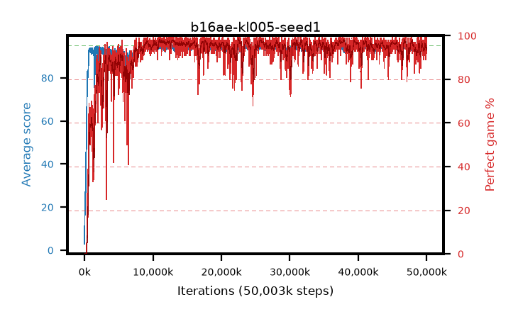

# b16ae-kl005-seed1

step **50,003,968** · 3052 evals · trailing **93.84** · peak **94.4** @45,301,760 · sef **93.6** · best30 **97.7** @13,074,432

## Config

| | |
|---|---|
| algo | ppo |
| collect_envs | 128 |
| discount | 0.99 |
| eval_interval | 16384 |
| eval_queue | True |
| eval_queue_depth | 16 |
| eval_workers | 8 |
| fc_layers | (320,) |
| graph_eval_episodes | 100 |
| max_steps | 50003968 |
| min_checkpoint_score | 40.0 |
| ppo_adam_epsilon | 1e-07 |
| ppo_anneal_fraction | 1.0 |
| ppo_clip | 0.2 |
| ppo_clip_final | None |
| ppo_entropy_coef | 0.01 |
| ppo_entropy_coef_final | None |
| ppo_epochs | 4 |
| ppo_gae_lambda | 0.98 |
| ppo_gradient_clipping | 0.5 |
| ppo_horizon | 33.6 |
| ppo_learning_rate | 0.0003 |
| ppo_learning_rate_final | None |
| ppo_minibatch | 256 |
| ppo_normalize_adv | True |
| ppo_rollout | 128 |
| ppo_target_kl | 0.005 |
| ppo_transitions_per_rollout | 16384 |
| ppo_value_loss | huber |
| ppo_vf_coef | 0.5 |
| seed | 1 |
| torch_threads | 1 |

## Evals

| step | avg score | trailing avg | min score | max score | avg reward | perfect % | epsilon |
|---|---|---|---|---|---|---|---|
| 16384 | 2.92 | 2.92 | 0.0 | 8.0 | 2.42 | 0.0 |  |
| 32768 | 16.94 | 13.44 | 3.0 | 36.0 | 11.94 | 0.0 |  |
| 49152 | 16.31 | 9.61 | 3.0 | 37.0 | 11.31 | 0.0 |  |
| ... | ... | ... | ... | ... | ... | ... | ... |
| 49823744 | 94.42 | 93.79 | 76.0 | 95.0 | 188.445 | 95.0 |  |
| 49840128 | 94.88 | 93.74 | 83.0 | 95.0 | 192.885 | 99.0 |  |
| 49856512 | 92.77 | 93.72 | 59.0 | 95.0 | 180.825 | 89.0 |  |
| 49872896 | 93.88 | 93.74 | 78.0 | 95.0 | 182.93 | 90.0 |  |
| 49889280 | 93.56 | 93.73 | 56.0 | 95.0 | 183.605 | 91.0 |  |
| 49905664 | 93.85 | 93.75 | 58.0 | 95.0 | 186.88 | 94.0 |  |
| 49922048 | 94.69 | 93.76 | 85.0 | 95.0 | 189.71 | 96.0 |  |
| 49938432 | 95.0 | 93.83 | 95.0 | 95.0 | 194.0 | 100.0 |  |
| 49954816 | 93.81 | 93.86 | 54.0 | 95.0 | 187.79 | 95.0 |  |
| 49971200 | 94.97 | 93.84 | 92.0 | 95.0 | 192.93 | 99.0 |  |
| 49987584 | 93.58 | 93.9 | 14.0 | 95.0 | 185.57 | 93.0 |  |
| 50003968 | 93.42 | 93.84 | 14.0 | 95.0 | 184.415 | 92.0 |  |
