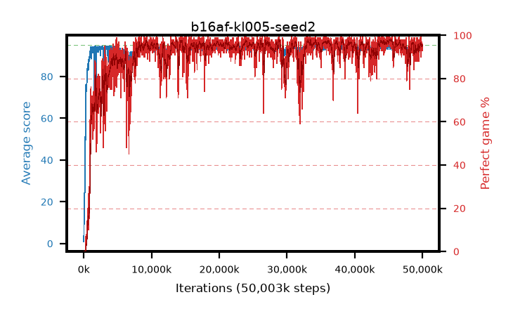

# b16af-kl005-seed2

step **50,003,968** · 3052 evals · trailing **94.25** · peak **94.5** @45,514,752 · sef **91.2** · best30 **97.7** @45,400,064

## Config

| | |
|---|---|
| algo | ppo |
| collect_envs | 128 |
| discount | 0.99 |
| eval_interval | 16384 |
| eval_queue | True |
| eval_queue_depth | 16 |
| eval_workers | 8 |
| fc_layers | (320,) |
| graph_eval_episodes | 100 |
| max_steps | 50003968 |
| min_checkpoint_score | 40.0 |
| ppo_adam_epsilon | 1e-07 |
| ppo_anneal_fraction | 1.0 |
| ppo_clip | 0.2 |
| ppo_clip_final | None |
| ppo_entropy_coef | 0.01 |
| ppo_entropy_coef_final | None |
| ppo_epochs | 4 |
| ppo_gae_lambda | 0.98 |
| ppo_gradient_clipping | 0.5 |
| ppo_horizon | 33.6 |
| ppo_learning_rate | 0.0003 |
| ppo_learning_rate_final | None |
| ppo_minibatch | 256 |
| ppo_normalize_adv | True |
| ppo_rollout | 128 |
| ppo_target_kl | 0.005 |
| ppo_transitions_per_rollout | 16384 |
| ppo_value_loss | huber |
| ppo_vf_coef | 0.5 |
| seed | 2 |
| torch_threads | 1 |

## Evals

| step | avg score | trailing avg | min score | max score | avg reward | perfect % | epsilon |
|---|---|---|---|---|---|---|---|
| 16384 | 0.9 | 0.9 | 0.0 | 5.0 | -0.05 | 0.0 |  |
| 32768 | 8.25 | 4.58 | 2.0 | 19.0 | 3.25 | 0.0 |  |
| 49152 | 10.77 | 6.64 | 2.0 | 26.0 | 5.77 | 0.0 |  |
| ... | ... | ... | ... | ... | ... | ... | ... |
| 49823744 | 94.24 | 94.1 | 71.0 | 95.0 | 187.27 | 94.0 |  |
| 49840128 | 94.36 | 94.11 | 60.0 | 95.0 | 189.38 | 96.0 |  |
| 49856512 | 94.3 | 94.15 | 66.0 | 95.0 | 189.32 | 96.0 |  |
| 49872896 | 94.46 | 94.28 | 71.0 | 95.0 | 188.485 | 95.0 |  |
| 49889280 | 93.79 | 94.26 | 10.0 | 95.0 | 188.81 | 96.0 |  |
| 49905664 | 94.63 | 94.21 | 81.0 | 95.0 | 190.645 | 97.0 |  |
| 49922048 | 94.31 | 94.32 | 57.0 | 95.0 | 189.33 | 96.0 |  |
| 49938432 | 93.71 | 94.3 | 26.0 | 95.0 | 187.735 | 95.0 |  |
| 49954816 | 93.55 | 94.31 | 20.0 | 95.0 | 185.54 | 93.0 |  |
| 49971200 | 93.73 | 94.31 | 24.0 | 95.0 | 188.75 | 96.0 |  |
| 49987584 | 94.15 | 94.29 | 56.0 | 95.0 | 188.175 | 95.0 |  |
| 50003968 | 93.39 | 94.25 | 18.0 | 95.0 | 185.38 | 93.0 |  |
