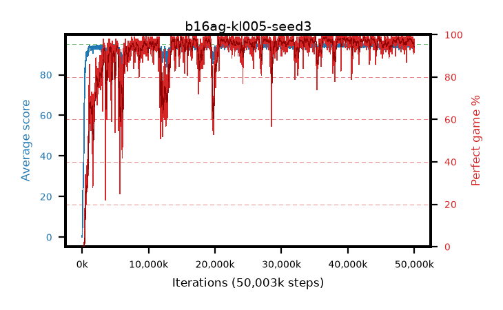

# b16ag-kl005-seed3

step **50,003,968** · 3052 evals · trailing **94.2** · peak **94.61** @36,864,000 · sef **89.8** · best30 **98.5** @36,683,776

## Config

| | |
|---|---|
| algo | ppo |
| collect_envs | 128 |
| discount | 0.99 |
| eval_interval | 16384 |
| eval_queue | True |
| eval_queue_depth | 16 |
| eval_workers | 8 |
| fc_layers | (320,) |
| graph_eval_episodes | 100 |
| max_steps | 50003968 |
| min_checkpoint_score | 40.0 |
| ppo_adam_epsilon | 1e-07 |
| ppo_anneal_fraction | 1.0 |
| ppo_clip | 0.2 |
| ppo_clip_final | None |
| ppo_entropy_coef | 0.01 |
| ppo_entropy_coef_final | None |
| ppo_epochs | 4 |
| ppo_gae_lambda | 0.98 |
| ppo_gradient_clipping | 0.5 |
| ppo_horizon | 33.6 |
| ppo_learning_rate | 0.0003 |
| ppo_learning_rate_final | None |
| ppo_minibatch | 256 |
| ppo_normalize_adv | True |
| ppo_rollout | 128 |
| ppo_target_kl | 0.005 |
| ppo_transitions_per_rollout | 16384 |
| ppo_value_loss | huber |
| ppo_vf_coef | 0.5 |
| seed | 3 |
| torch_threads | 1 |

## Evals

| step | avg score | trailing avg | min score | max score | avg reward | perfect % | epsilon |
|---|---|---|---|---|---|---|---|
| 16384 | 0.05 | 0.05 | 0.0 | 1.0 | -0.45 | 0.0 |  |
| 32768 | 1.81 | 2.97 | 0.0 | 5.0 | -1.345 | 0.0 |  |
| 49152 | 7.04 | 3.54 | 2.0 | 14.0 | 2.13 | 0.0 |  |
| ... | ... | ... | ... | ... | ... | ... | ... |
| 49823744 | 93.71 | 94.32 | 33.0 | 95.0 | 187.69 | 95.0 |  |
| 49840128 | 94.69 | 94.31 | 80.0 | 95.0 | 189.71 | 96.0 |  |
| 49856512 | 94.82 | 94.4 | 85.0 | 95.0 | 189.84 | 96.0 |  |
| 49872896 | 94.62 | 94.34 | 83.0 | 95.0 | 188.645 | 95.0 |  |
| 49889280 | 94.13 | 94.38 | 74.0 | 95.0 | 185.17 | 92.0 |  |
| 49905664 | 92.82 | 94.19 | 14.0 | 95.0 | 185.85 | 94.0 |  |
| 49922048 | 94.01 | 94.23 | 75.0 | 95.0 | 184.055 | 91.0 |  |
| 49938432 | 92.76 | 94.25 | 10.0 | 95.0 | 184.795 | 93.0 |  |
| 49954816 | 92.97 | 94.33 | 24.0 | 95.0 | 186.995 | 95.0 |  |
| 49971200 | 94.72 | 94.32 | 79.0 | 95.0 | 191.73 | 98.0 |  |
| 49987584 | 92.64 | 94.14 | 16.0 | 95.0 | 185.58 | 94.0 |  |
| 50003968 | 93.3 | 94.2 | 26.0 | 95.0 | 187.28 | 95.0 |  |
