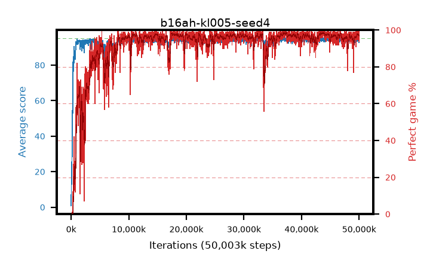

# b16ah-kl005-seed4

step **50,003,968** · 3052 evals · trailing **94.3** · peak **94.62** @44,384,256 · sef **90.8** · best30 **98.4** @37,371,904

## Config

| | |
|---|---|
| algo | ppo |
| collect_envs | 128 |
| discount | 0.99 |
| eval_interval | 16384 |
| eval_queue | True |
| eval_queue_depth | 16 |
| eval_workers | 8 |
| fc_layers | (320,) |
| graph_eval_episodes | 100 |
| max_steps | 50003968 |
| min_checkpoint_score | 40.0 |
| ppo_adam_epsilon | 1e-07 |
| ppo_anneal_fraction | 1.0 |
| ppo_clip | 0.2 |
| ppo_clip_final | None |
| ppo_entropy_coef | 0.01 |
| ppo_entropy_coef_final | None |
| ppo_epochs | 4 |
| ppo_gae_lambda | 0.98 |
| ppo_gradient_clipping | 0.5 |
| ppo_horizon | 33.6 |
| ppo_learning_rate | 0.0003 |
| ppo_learning_rate_final | None |
| ppo_minibatch | 256 |
| ppo_normalize_adv | True |
| ppo_rollout | 128 |
| ppo_target_kl | 0.005 |
| ppo_transitions_per_rollout | 16384 |
| ppo_value_loss | huber |
| ppo_vf_coef | 0.5 |
| seed | 4 |
| torch_threads | 1 |

## Evals

| step | avg score | trailing avg | min score | max score | avg reward | perfect % | epsilon |
|---|---|---|---|---|---|---|---|
| 16384 | 0.85 | 0.85 | 0.0 | 7.0 | 0.17 | 0.0 |  |
| 32768 | 11.62 | 8.78 | 0.0 | 29.0 | 6.665 | 0.0 |  |
| 49152 | 13.88 | 7.37 | 4.0 | 29.0 | 8.88 | 0.0 |  |
| ... | ... | ... | ... | ... | ... | ... | ... |
| 49823744 | 94.26 | 94.18 | 63.0 | 95.0 | 190.275 | 97.0 |  |
| 49840128 | 94.73 | 94.25 | 68.0 | 95.0 | 192.735 | 99.0 |  |
| 49856512 | 94.51 | 94.31 | 69.0 | 95.0 | 191.52 | 98.0 |  |
| 49872896 | 93.61 | 94.26 | 24.0 | 95.0 | 187.59 | 95.0 |  |
| 49889280 | 94.34 | 94.35 | 59.0 | 95.0 | 191.35 | 98.0 |  |
| 49905664 | 93.77 | 94.32 | 8.0 | 95.0 | 190.78 | 98.0 |  |
| 49922048 | 93.3 | 94.38 | 26.0 | 95.0 | 188.32 | 96.0 |  |
| 49938432 | 95.0 | 94.36 | 95.0 | 95.0 | 194.0 | 100.0 |  |
| 49954816 | 92.91 | 94.36 | 10.0 | 95.0 | 186.935 | 95.0 |  |
| 49971200 | 94.72 | 94.41 | 80.0 | 95.0 | 191.73 | 98.0 |  |
| 49987584 | 94.58 | 94.42 | 77.0 | 95.0 | 190.595 | 97.0 |  |
| 50003968 | 92.67 | 94.3 | 24.0 | 95.0 | 185.7 | 94.0 |  |
