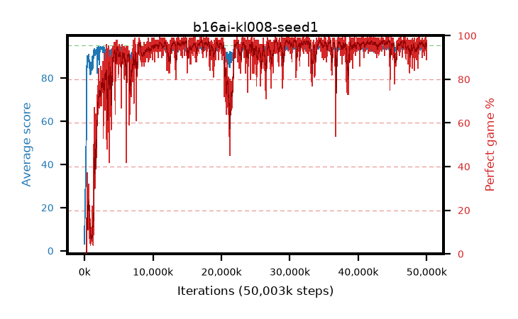

# b16ai-kl008-seed1

step **50,003,968** · 3052 evals · trailing **93.94** · peak **94.45** @32,653,312 · sef **90.0** · best30 **97.3** @28,114,944

## Config

| | |
|---|---|
| algo | ppo |
| collect_envs | 128 |
| discount | 0.99 |
| eval_interval | 16384 |
| eval_queue | True |
| eval_queue_depth | 16 |
| eval_workers | 8 |
| fc_layers | (320,) |
| graph_eval_episodes | 100 |
| max_steps | 50003968 |
| min_checkpoint_score | 40.0 |
| ppo_adam_epsilon | 1e-07 |
| ppo_anneal_fraction | 1.0 |
| ppo_clip | 0.2 |
| ppo_clip_final | None |
| ppo_entropy_coef | 0.01 |
| ppo_entropy_coef_final | None |
| ppo_epochs | 4 |
| ppo_gae_lambda | 0.98 |
| ppo_gradient_clipping | 0.5 |
| ppo_horizon | 33.6 |
| ppo_learning_rate | 0.0003 |
| ppo_learning_rate_final | None |
| ppo_minibatch | 256 |
| ppo_normalize_adv | True |
| ppo_rollout | 128 |
| ppo_target_kl | 0.008 |
| ppo_transitions_per_rollout | 16384 |
| ppo_value_loss | huber |
| ppo_vf_coef | 0.5 |
| seed | 1 |
| torch_threads | 1 |

## Evals

| step | avg score | trailing avg | min score | max score | avg reward | perfect % | epsilon |
|---|---|---|---|---|---|---|---|
| 16384 | 3.18 | 3.18 | 0.0 | 14.0 | 2.618 | 0.0 |  |
| 32768 | 17.51 | 15.02 | 2.0 | 32.0 | 12.477 | 0.0 |  |
| 49152 | 15.81 | 14.4 | 4.0 | 35.0 | 10.803 | 0.0 |  |
| ... | ... | ... | ... | ... | ... | ... | ... |
| 49823744 | 93.91 | 93.92 | 6.0 | 95.0 | 190.643 | 98.0 |  |
| 49840128 | 94.8 | 93.95 | 80.0 | 95.0 | 191.513 | 98.0 |  |
| 49856512 | 93.85 | 93.94 | 8.0 | 95.0 | 189.575 | 97.0 |  |
| 49872896 | 93.59 | 93.94 | 2.0 | 95.0 | 189.319 | 97.0 |  |
| 49889280 | 95.0 | 93.99 | 95.0 | 95.0 | 193.716 | 100.0 |  |
| 49905664 | 94.42 | 93.92 | 80.0 | 95.0 | 186.139 | 93.0 |  |
| 49922048 | 93.36 | 93.94 | 2.0 | 95.0 | 186.086 | 94.0 |  |
| 49938432 | 94.87 | 93.91 | 87.0 | 95.0 | 191.572 | 98.0 |  |
| 49954816 | 94.49 | 93.97 | 78.0 | 95.0 | 187.206 | 94.0 |  |
| 49971200 | 93.04 | 93.9 | 16.0 | 95.0 | 180.785 | 89.0 |  |
| 49987584 | 93.69 | 93.96 | 22.0 | 95.0 | 187.403 | 95.0 |  |
| 50003968 | 94.32 | 93.94 | 84.0 | 95.0 | 183.054 | 90.0 |  |
