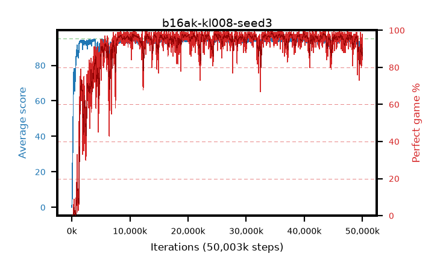

# b16ak-kl008-seed3

step **50,003,968** · 3052 evals · trailing **92.9** · peak **94.63** @34,553,856 · sef **90.2** · best30 **98.1** @34,635,776

## Config

| | |
|---|---|
| algo | ppo |
| collect_envs | 128 |
| discount | 0.99 |
| eval_interval | 16384 |
| eval_queue | True |
| eval_queue_depth | 16 |
| eval_workers | 8 |
| fc_layers | (320,) |
| graph_eval_episodes | 100 |
| max_steps | 50003968 |
| min_checkpoint_score | 40.0 |
| ppo_adam_epsilon | 1e-07 |
| ppo_anneal_fraction | 1.0 |
| ppo_clip | 0.2 |
| ppo_clip_final | None |
| ppo_entropy_coef | 0.01 |
| ppo_entropy_coef_final | None |
| ppo_epochs | 4 |
| ppo_gae_lambda | 0.98 |
| ppo_gradient_clipping | 0.5 |
| ppo_horizon | 33.6 |
| ppo_learning_rate | 0.0003 |
| ppo_learning_rate_final | None |
| ppo_minibatch | 256 |
| ppo_normalize_adv | True |
| ppo_rollout | 128 |
| ppo_target_kl | 0.008 |
| ppo_transitions_per_rollout | 16384 |
| ppo_value_loss | huber |
| ppo_vf_coef | 0.5 |
| seed | 3 |
| torch_threads | 1 |

## Evals

| step | avg score | trailing avg | min score | max score | avg reward | perfect % | epsilon |
|---|---|---|---|---|---|---|---|
| 16384 | 0.07 | 0.07 | 0.0 | 1.0 | -0.481 | 0.0 |  |
| 32768 | 1.86 | 0.97 | 0.0 | 5.0 | -1.523 | 0.0 |  |
| 49152 | 6.85 | 2.93 | 2.0 | 18.0 | 1.932 | 0.0 |  |
| ... | ... | ... | ... | ... | ... | ... | ... |
| 49823744 | 91.27 | 92.43 | 24.0 | 95.0 | 170.961 | 81.0 |  |
| 49840128 | 89.48 | 92.48 | 4.0 | 95.0 | 169.165 | 81.0 |  |
| 49856512 | 93.26 | 92.63 | 64.0 | 95.0 | 179.893 | 88.0 |  |
| 49872896 | 92.59 | 92.49 | 57.0 | 95.0 | 179.29 | 88.0 |  |
| 49889280 | 94.18 | 92.49 | 73.0 | 95.0 | 187.851 | 95.0 |  |
| 49905664 | 93.91 | 92.59 | 77.0 | 95.0 | 181.614 | 89.0 |  |
| 49922048 | 93.31 | 92.48 | 30.0 | 95.0 | 181.024 | 89.0 |  |
| 49938432 | 93.52 | 92.71 | 61.0 | 95.0 | 181.21 | 89.0 |  |
| 49954816 | 91.66 | 92.51 | 6.0 | 95.0 | 174.33 | 84.0 |  |
| 49971200 | 92.15 | 92.76 | 14.0 | 95.0 | 179.856 | 89.0 |  |
| 49987584 | 93.87 | 93.0 | 28.0 | 95.0 | 187.57 | 95.0 |  |
| 50003968 | 94.18 | 92.9 | 20.0 | 95.0 | 190.88 | 98.0 |  |
