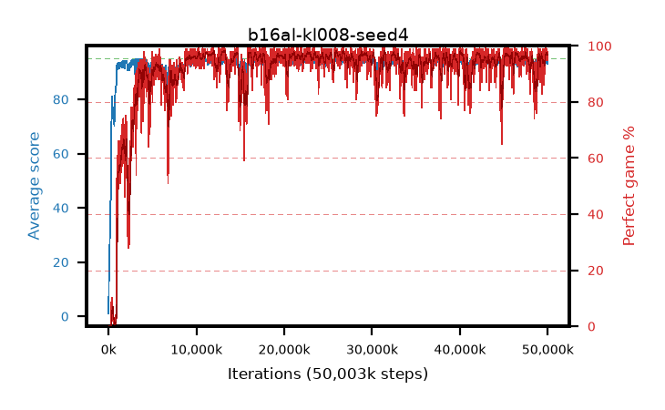

# b16al-kl008-seed4

step **50,003,968** · 3052 evals · trailing **93.94** · peak **94.49** @29,540,352 · sef **91.3** · best30 **98.1** @13,238,272

## Config

| | |
|---|---|
| algo | ppo |
| collect_envs | 128 |
| discount | 0.99 |
| eval_interval | 16384 |
| eval_queue | True |
| eval_queue_depth | 16 |
| eval_workers | 8 |
| fc_layers | (320,) |
| graph_eval_episodes | 100 |
| max_steps | 50003968 |
| min_checkpoint_score | 40.0 |
| ppo_adam_epsilon | 1e-07 |
| ppo_anneal_fraction | 1.0 |
| ppo_clip | 0.2 |
| ppo_clip_final | None |
| ppo_entropy_coef | 0.01 |
| ppo_entropy_coef_final | None |
| ppo_epochs | 4 |
| ppo_gae_lambda | 0.98 |
| ppo_gradient_clipping | 0.5 |
| ppo_horizon | 33.6 |
| ppo_learning_rate | 0.0003 |
| ppo_learning_rate_final | None |
| ppo_minibatch | 256 |
| ppo_normalize_adv | True |
| ppo_rollout | 128 |
| ppo_target_kl | 0.008 |
| ppo_transitions_per_rollout | 16384 |
| ppo_value_loss | huber |
| ppo_vf_coef | 0.5 |
| seed | 4 |
| torch_threads | 1 |

## Evals

| step | avg score | trailing avg | min score | max score | avg reward | perfect % | epsilon |
|---|---|---|---|---|---|---|---|
| 16384 | 1.04 | 1.04 | 0.0 | 7.0 | 0.262 | 0.0 |  |
| 32768 | 11.4 | 6.22 | 0.0 | 23.0 | 6.474 | 0.0 |  |
| 49152 | 13.83 | 8.76 | 2.0 | 30.0 | 8.826 | 0.0 |  |
| ... | ... | ... | ... | ... | ... | ... | ... |
| 49823744 | 93.88 | 93.71 | 35.0 | 95.0 | 188.579 | 96.0 |  |
| 49840128 | 94.81 | 93.89 | 86.0 | 95.0 | 190.524 | 97.0 |  |
| 49856512 | 94.53 | 93.78 | 76.0 | 95.0 | 190.244 | 97.0 |  |
| 49872896 | 94.84 | 93.89 | 89.0 | 95.0 | 190.562 | 97.0 |  |
| 49889280 | 93.28 | 93.96 | 25.0 | 95.0 | 186.973 | 95.0 |  |
| 49905664 | 94.67 | 93.91 | 62.0 | 95.0 | 192.393 | 99.0 |  |
| 49922048 | 94.42 | 93.96 | 57.0 | 95.0 | 191.136 | 98.0 |  |
| 49938432 | 94.56 | 93.81 | 57.0 | 95.0 | 191.287 | 98.0 |  |
| 49954816 | 93.03 | 93.65 | 22.0 | 95.0 | 187.736 | 96.0 |  |
| 49971200 | 93.55 | 93.69 | 26.0 | 95.0 | 188.25 | 96.0 |  |
| 49987584 | 94.54 | 93.87 | 72.0 | 95.0 | 190.269 | 97.0 |  |
| 50003968 | 94.05 | 93.94 | 63.0 | 95.0 | 187.787 | 95.0 |  |
