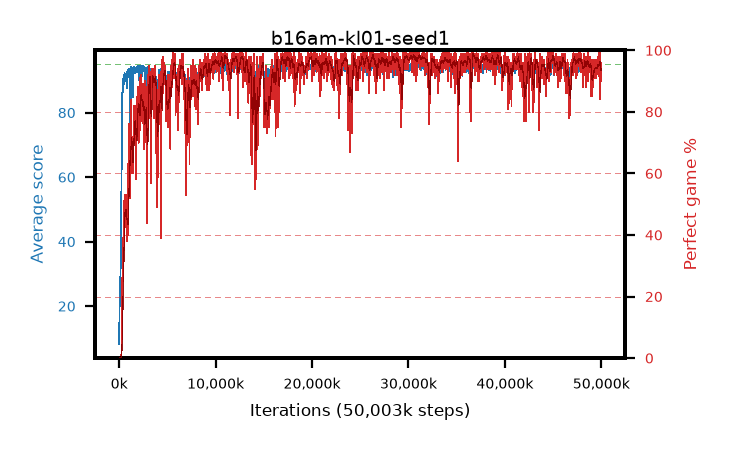

# b16am-kl01-seed1

step **50,003,968** · 3052 evals · trailing **93.74** · peak **94.54** @36,913,152 · sef **92.1** · best30 **98.1** @30,523,392

## Config

| | |
|---|---|
| algo | ppo |
| collect_envs | 128 |
| discount | 0.99 |
| eval_interval | 16384 |
| eval_queue | True |
| eval_queue_depth | 16 |
| eval_workers | 8 |
| fc_layers | (320,) |
| graph_eval_episodes | 100 |
| max_steps | 50003968 |
| min_checkpoint_score | 40.0 |
| ppo_adam_epsilon | 1e-07 |
| ppo_anneal_fraction | 1.0 |
| ppo_clip | 0.2 |
| ppo_clip_final | None |
| ppo_entropy_coef | 0.01 |
| ppo_entropy_coef_final | None |
| ppo_epochs | 4 |
| ppo_gae_lambda | 0.98 |
| ppo_gradient_clipping | 0.5 |
| ppo_horizon | 33.6 |
| ppo_learning_rate | 0.0003 |
| ppo_learning_rate_final | None |
| ppo_minibatch | 256 |
| ppo_normalize_adv | True |
| ppo_rollout | 128 |
| ppo_target_kl | 0.01 |
| ppo_transitions_per_rollout | 16384 |
| ppo_value_loss | huber |
| ppo_vf_coef | 0.5 |
| seed | 1 |
| torch_threads | 1 |

## Evals

| step | avg score | trailing avg | min score | max score | avg reward | perfect % | epsilon |
|---|---|---|---|---|---|---|---|
| 16384 | 8.22 | 19.35 | 0.0 | 27.0 | 7.275 | 0.0 |  |
| 32768 | 19.36 | 19.36 | 7.0 | 41.0 | 14.334 | 0.0 |  |
| 49152 | 20.05 | 19.7 | 5.0 | 36.0 | 15.083 | 0.0 |  |
| ... | ... | ... | ... | ... | ... | ... | ... |
| 49823744 | 93.66 | 93.89 | 28.0 | 95.0 | 188.375 | 96.0 |  |
| 49840128 | 94.55 | 93.92 | 75.0 | 95.0 | 190.242 | 97.0 |  |
| 49856512 | 95.0 | 93.82 | 95.0 | 95.0 | 193.72 | 100.0 |  |
| 49872896 | 94.05 | 93.75 | 42.0 | 95.0 | 190.719 | 98.0 |  |
| 49889280 | 93.72 | 93.78 | 14.0 | 95.0 | 187.422 | 95.0 |  |
| 49905664 | 90.45 | 93.79 | 5.0 | 95.0 | 173.152 | 84.0 |  |
| 49922048 | 93.49 | 93.76 | 10.0 | 95.0 | 185.214 | 93.0 |  |
| 49938432 | 92.78 | 93.77 | 8.0 | 95.0 | 181.505 | 90.0 |  |
| 49954816 | 93.43 | 93.72 | 66.0 | 95.0 | 184.149 | 92.0 |  |
| 49971200 | 94.37 | 93.76 | 65.0 | 95.0 | 188.084 | 95.0 |  |
| 49987584 | 93.34 | 93.75 | 28.0 | 95.0 | 186.066 | 94.0 |  |
| 50003968 | 94.57 | 93.74 | 74.0 | 95.0 | 189.288 | 96.0 |  |
