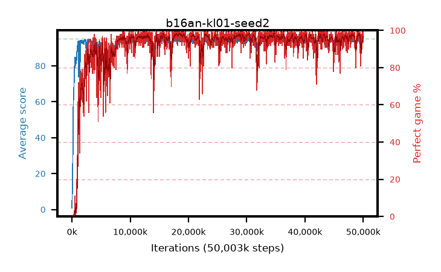

# b16an-kl01-seed2

step **50,003,968** · 3052 evals · trailing **93.72** · peak **94.58** @49,446,912 · sef **92.3** · best30 **98.0** @18,644,992

## Config

| | |
|---|---|
| algo | ppo |
| collect_envs | 128 |
| discount | 0.99 |
| eval_interval | 16384 |
| eval_queue | True |
| eval_queue_depth | 16 |
| eval_workers | 8 |
| fc_layers | (320,) |
| graph_eval_episodes | 100 |
| max_steps | 50003968 |
| min_checkpoint_score | 40.0 |
| ppo_adam_epsilon | 1e-07 |
| ppo_anneal_fraction | 1.0 |
| ppo_clip | 0.2 |
| ppo_clip_final | None |
| ppo_entropy_coef | 0.01 |
| ppo_entropy_coef_final | None |
| ppo_epochs | 4 |
| ppo_gae_lambda | 0.98 |
| ppo_gradient_clipping | 0.5 |
| ppo_horizon | 33.6 |
| ppo_learning_rate | 0.0003 |
| ppo_learning_rate_final | None |
| ppo_minibatch | 256 |
| ppo_normalize_adv | True |
| ppo_rollout | 128 |
| ppo_target_kl | 0.01 |
| ppo_transitions_per_rollout | 16384 |
| ppo_value_loss | huber |
| ppo_vf_coef | 0.5 |
| seed | 2 |
| torch_threads | 1 |

## Evals

| step | avg score | trailing avg | min score | max score | avg reward | perfect % | epsilon |
|---|---|---|---|---|---|---|---|
| 16384 | 0.85 | 0.85 | 0.0 | 5.0 | -0.101 | 0.0 |  |
| 32768 | 8.14 | 4.5 | 2.0 | 17.0 | 3.133 | 0.0 |  |
| 49152 | 9.14 | 6.04 | 2.0 | 26.0 | 4.132 | 0.0 |  |
| ... | ... | ... | ... | ... | ... | ... | ... |
| 49823744 | 93.51 | 93.67 | 4.0 | 95.0 | 187.184 | 95.0 |  |
| 49840128 | 94.47 | 93.61 | 78.0 | 95.0 | 188.167 | 95.0 |  |
| 49856512 | 93.92 | 93.59 | 42.0 | 95.0 | 187.595 | 95.0 |  |
| 49872896 | 93.66 | 93.76 | 14.0 | 95.0 | 188.377 | 96.0 |  |
| 49889280 | 94.46 | 93.75 | 65.0 | 95.0 | 190.185 | 97.0 |  |
| 49905664 | 95.0 | 93.65 | 95.0 | 95.0 | 193.705 | 100.0 |  |
| 49922048 | 93.75 | 93.63 | 12.0 | 95.0 | 188.479 | 96.0 |  |
| 49938432 | 94.55 | 93.62 | 68.0 | 95.0 | 191.28 | 98.0 |  |
| 49954816 | 93.06 | 93.66 | 12.0 | 95.0 | 188.796 | 97.0 |  |
| 49971200 | 93.55 | 93.64 | 30.0 | 95.0 | 186.293 | 94.0 |  |
| 49987584 | 94.66 | 93.66 | 76.0 | 95.0 | 191.371 | 98.0 |  |
| 50003968 | 94.88 | 93.72 | 83.0 | 95.0 | 192.601 | 99.0 |  |
