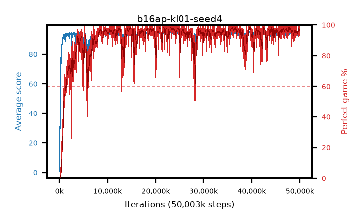

# b16ap-kl01-seed4

step **50,003,968** · 3052 evals · trailing **94.13** · peak **94.63** @42,614,784 · sef **89.3** · best30 **98.0** @36,044,800

## Config

| | |
|---|---|
| algo | ppo |
| collect_envs | 128 |
| discount | 0.99 |
| eval_interval | 16384 |
| eval_queue | True |
| eval_queue_depth | 16 |
| eval_workers | 8 |
| fc_layers | (320,) |
| graph_eval_episodes | 100 |
| max_steps | 50003968 |
| min_checkpoint_score | 40.0 |
| ppo_adam_epsilon | 1e-07 |
| ppo_anneal_fraction | 1.0 |
| ppo_clip | 0.2 |
| ppo_clip_final | None |
| ppo_entropy_coef | 0.01 |
| ppo_entropy_coef_final | None |
| ppo_epochs | 4 |
| ppo_gae_lambda | 0.98 |
| ppo_gradient_clipping | 0.5 |
| ppo_horizon | 33.6 |
| ppo_learning_rate | 0.0003 |
| ppo_learning_rate_final | None |
| ppo_minibatch | 256 |
| ppo_normalize_adv | True |
| ppo_rollout | 128 |
| ppo_target_kl | 0.01 |
| ppo_transitions_per_rollout | 16384 |
| ppo_value_loss | huber |
| ppo_vf_coef | 0.5 |
| seed | 4 |
| torch_threads | 1 |

## Evals

| step | avg score | trailing avg | min score | max score | avg reward | perfect % | epsilon |
|---|---|---|---|---|---|---|---|
| 16384 | 0.81 | 0.81 | 0.0 | 4.0 | -0.033 | 0.0 |  |
| 32768 | 10.6 | 5.71 | 3.0 | 19.0 | 5.586 | 0.0 |  |
| 49152 | 16.72 | 9.38 | 3.0 | 33.0 | 11.711 | 0.0 |  |
| ... | ... | ... | ... | ... | ... | ... | ... |
| 49823744 | 94.38 | 94.04 | 79.0 | 95.0 | 186.111 | 93.0 |  |
| 49840128 | 94.84 | 94.05 | 80.0 | 95.0 | 191.515 | 98.0 |  |
| 49856512 | 94.25 | 94.09 | 56.0 | 95.0 | 189.964 | 97.0 |  |
| 49872896 | 94.75 | 94.07 | 70.0 | 95.0 | 192.473 | 99.0 |  |
| 49889280 | 94.03 | 94.06 | 12.0 | 95.0 | 190.759 | 98.0 |  |
| 49905664 | 94.26 | 94.09 | 76.0 | 95.0 | 187.993 | 95.0 |  |
| 49922048 | 94.91 | 94.13 | 86.0 | 95.0 | 192.625 | 99.0 |  |
| 49938432 | 93.65 | 94.09 | 10.0 | 95.0 | 189.378 | 97.0 |  |
| 49954816 | 94.62 | 94.11 | 59.0 | 95.0 | 191.296 | 98.0 |  |
| 49971200 | 93.66 | 94.1 | 69.0 | 95.0 | 186.399 | 94.0 |  |
| 49987584 | 93.78 | 94.07 | 65.0 | 95.0 | 185.521 | 93.0 |  |
| 50003968 | 94.48 | 94.13 | 66.0 | 95.0 | 190.191 | 97.0 |  |
