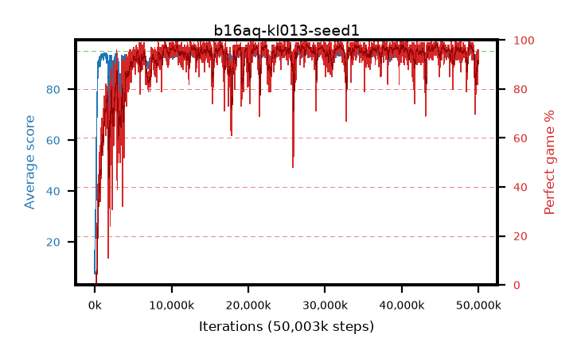

# b16aq-kl013-seed1

step **50,003,968** · 3052 evals · trailing **92.81** · peak **94.58** @44,597,248 · sef **91.6** · best30 **97.7** @44,646,400

## Config

| | |
|---|---|
| algo | ppo |
| collect_envs | 128 |
| discount | 0.99 |
| eval_interval | 16384 |
| eval_queue | True |
| eval_queue_depth | 16 |
| eval_workers | 8 |
| fc_layers | (320,) |
| graph_eval_episodes | 100 |
| max_steps | 50003968 |
| min_checkpoint_score | 40.0 |
| ppo_adam_epsilon | 1e-07 |
| ppo_anneal_fraction | 1.0 |
| ppo_clip | 0.2 |
| ppo_clip_final | None |
| ppo_entropy_coef | 0.01 |
| ppo_entropy_coef_final | None |
| ppo_epochs | 4 |
| ppo_gae_lambda | 0.98 |
| ppo_gradient_clipping | 0.5 |
| ppo_horizon | 33.6 |
| ppo_learning_rate | 0.0003 |
| ppo_learning_rate_final | None |
| ppo_minibatch | 256 |
| ppo_normalize_adv | True |
| ppo_rollout | 128 |
| ppo_target_kl | 0.013 |
| ppo_transitions_per_rollout | 16384 |
| ppo_value_loss | huber |
| ppo_vf_coef | 0.5 |
| seed | 1 |
| torch_threads | 1 |

## Evals

| step | avg score | trailing avg | min score | max score | avg reward | perfect % | epsilon |
|---|---|---|---|---|---|---|---|
| 16384 | 7.47 | 19.6 | 0.0 | 32.0 | 6.536 | 0.0 |  |
| 32768 | 22.88 | 22.63 | 7.0 | 44.0 | 17.844 | 0.0 |  |
| 49152 | 21.36 | 21.36 | 7.0 | 37.0 | 16.388 | 0.0 |  |
| ... | ... | ... | ... | ... | ... | ... | ... |
| 49823744 | 94.53 | 92.88 | 64.0 | 95.0 | 189.251 | 96.0 |  |
| 49840128 | 93.03 | 92.84 | 61.0 | 95.0 | 180.761 | 89.0 |  |
| 49856512 | 94.15 | 92.74 | 72.0 | 95.0 | 187.849 | 95.0 |  |
| 49872896 | 92.33 | 92.84 | 60.0 | 95.0 | 173.027 | 82.0 |  |
| 49889280 | 92.16 | 92.91 | 61.0 | 95.0 | 175.879 | 85.0 |  |
| 49905664 | 92.35 | 92.75 | 20.0 | 95.0 | 177.099 | 86.0 |  |
| 49922048 | 93.89 | 92.73 | 68.0 | 95.0 | 184.599 | 92.0 |  |
| 49938432 | 93.65 | 92.79 | 60.0 | 95.0 | 186.362 | 94.0 |  |
| 49954816 | 94.02 | 92.74 | 72.0 | 95.0 | 185.734 | 93.0 |  |
| 49971200 | 94.05 | 92.74 | 61.0 | 95.0 | 187.77 | 95.0 |  |
| 49987584 | 94.3 | 92.85 | 57.0 | 95.0 | 189.021 | 96.0 |  |
| 50003968 | 94.33 | 92.81 | 68.0 | 95.0 | 188.001 | 95.0 |  |
