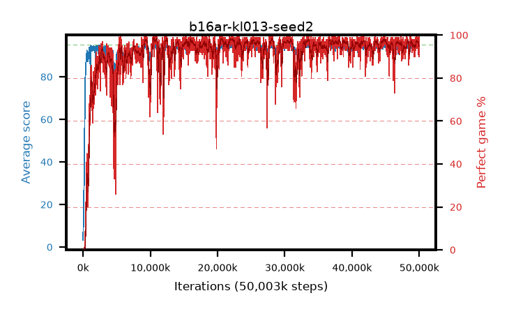

# b16ar-kl013-seed2

step **50,003,968** · 3052 evals · trailing **94.22** · peak **94.54** @28,164,096 · sef **92.7** · best30 **98.1** @22,200,320

## Config

| | |
|---|---|
| algo | ppo |
| collect_envs | 128 |
| discount | 0.99 |
| eval_interval | 16384 |
| eval_queue | True |
| eval_queue_depth | 16 |
| eval_workers | 8 |
| fc_layers | (320,) |
| graph_eval_episodes | 100 |
| max_steps | 50003968 |
| min_checkpoint_score | 40.0 |
| ppo_adam_epsilon | 1e-07 |
| ppo_anneal_fraction | 1.0 |
| ppo_clip | 0.2 |
| ppo_clip_final | None |
| ppo_entropy_coef | 0.01 |
| ppo_entropy_coef_final | None |
| ppo_epochs | 4 |
| ppo_gae_lambda | 0.98 |
| ppo_gradient_clipping | 0.5 |
| ppo_horizon | 33.6 |
| ppo_learning_rate | 0.0003 |
| ppo_learning_rate_final | None |
| ppo_minibatch | 256 |
| ppo_normalize_adv | True |
| ppo_rollout | 128 |
| ppo_target_kl | 0.013 |
| ppo_transitions_per_rollout | 16384 |
| ppo_value_loss | huber |
| ppo_vf_coef | 0.5 |
| seed | 2 |
| torch_threads | 1 |

## Evals

| step | avg score | trailing avg | min score | max score | avg reward | perfect % | epsilon |
|---|---|---|---|---|---|---|---|
| 16384 | 3.27 | 3.27 | 0.0 | 10.0 | 0.571 | 0.0 |  |
| 32768 | 9.57 | 6.42 | 2.0 | 18.0 | 4.553 | 0.0 |  |
| 49152 | 9.3 | 7.38 | 2.0 | 24.0 | 4.293 | 0.0 |  |
| ... | ... | ... | ... | ... | ... | ... | ... |
| 49823744 | 94.9 | 94.02 | 85.0 | 95.0 | 192.624 | 99.0 |  |
| 49840128 | 93.79 | 94.18 | 16.0 | 95.0 | 186.465 | 94.0 |  |
| 49856512 | 93.95 | 94.2 | 63.0 | 95.0 | 186.653 | 94.0 |  |
| 49872896 | 94.76 | 94.34 | 81.0 | 95.0 | 190.471 | 97.0 |  |
| 49889280 | 94.16 | 94.33 | 62.0 | 95.0 | 188.883 | 96.0 |  |
| 49905664 | 93.09 | 94.29 | 35.0 | 95.0 | 182.778 | 91.0 |  |
| 49922048 | 93.81 | 94.25 | 20.0 | 95.0 | 188.531 | 96.0 |  |
| 49938432 | 94.01 | 94.37 | 22.0 | 95.0 | 188.725 | 96.0 |  |
| 49954816 | 92.94 | 94.31 | 5.0 | 95.0 | 181.618 | 90.0 |  |
| 49971200 | 94.49 | 94.24 | 69.0 | 95.0 | 188.197 | 95.0 |  |
| 49987584 | 95.0 | 94.25 | 95.0 | 95.0 | 193.697 | 100.0 |  |
| 50003968 | 93.49 | 94.22 | 5.0 | 95.0 | 188.201 | 96.0 |  |
