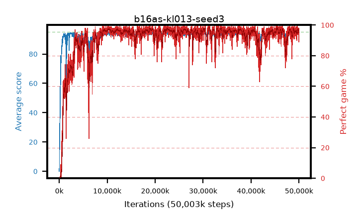

# b16as-kl013-seed3

step **50,003,968** · 3052 evals · trailing **94.22** · peak **94.48** @45,268,992 · sef **90.8** · best30 **97.5** @22,872,064

## Config

| | |
|---|---|
| algo | ppo |
| collect_envs | 128 |
| discount | 0.99 |
| eval_interval | 16384 |
| eval_queue | True |
| eval_queue_depth | 16 |
| eval_workers | 8 |
| fc_layers | (320,) |
| graph_eval_episodes | 100 |
| max_steps | 50003968 |
| min_checkpoint_score | 40.0 |
| ppo_adam_epsilon | 1e-07 |
| ppo_anneal_fraction | 1.0 |
| ppo_clip | 0.2 |
| ppo_clip_final | None |
| ppo_entropy_coef | 0.01 |
| ppo_entropy_coef_final | None |
| ppo_epochs | 4 |
| ppo_gae_lambda | 0.98 |
| ppo_gradient_clipping | 0.5 |
| ppo_horizon | 33.6 |
| ppo_learning_rate | 0.0003 |
| ppo_learning_rate_final | None |
| ppo_minibatch | 256 |
| ppo_normalize_adv | True |
| ppo_rollout | 128 |
| ppo_target_kl | 0.013 |
| ppo_transitions_per_rollout | 16384 |
| ppo_value_loss | huber |
| ppo_vf_coef | 0.5 |
| seed | 3 |
| torch_threads | 1 |

## Evals

| step | avg score | trailing avg | min score | max score | avg reward | perfect % | epsilon |
|---|---|---|---|---|---|---|---|
| 16384 | 0.01 | 0.01 | 0.0 | 1.0 | -4.279 | 0.0 |  |
| 32768 | 3.01 | 1.51 | 0.0 | 10.0 | 1.448 | 0.0 |  |
| 49152 | 20.71 | 12.44 | 4.0 | 45.0 | 15.845 | 0.0 |  |
| ... | ... | ... | ... | ... | ... | ... | ... |
| 49823744 | 94.63 | 94.22 | 69.0 | 95.0 | 191.331 | 98.0 |  |
| 49840128 | 93.93 | 94.23 | 23.0 | 95.0 | 186.566 | 94.0 |  |
| 49856512 | 93.64 | 94.21 | 24.0 | 95.0 | 190.355 | 98.0 |  |
| 49872896 | 94.18 | 94.3 | 71.0 | 95.0 | 187.907 | 95.0 |  |
| 49889280 | 93.49 | 94.22 | 8.0 | 95.0 | 187.211 | 95.0 |  |
| 49905664 | 94.62 | 94.25 | 76.0 | 95.0 | 190.337 | 97.0 |  |
| 49922048 | 93.65 | 94.23 | 15.0 | 95.0 | 187.333 | 95.0 |  |
| 49938432 | 94.29 | 94.29 | 77.0 | 95.0 | 186.02 | 93.0 |  |
| 49954816 | 93.02 | 94.26 | 27.0 | 95.0 | 180.717 | 89.0 |  |
| 49971200 | 94.91 | 94.23 | 88.0 | 95.0 | 191.628 | 98.0 |  |
| 49987584 | 94.52 | 94.21 | 74.0 | 95.0 | 189.246 | 96.0 |  |
| 50003968 | 94.64 | 94.22 | 72.0 | 95.0 | 190.355 | 97.0 |  |
