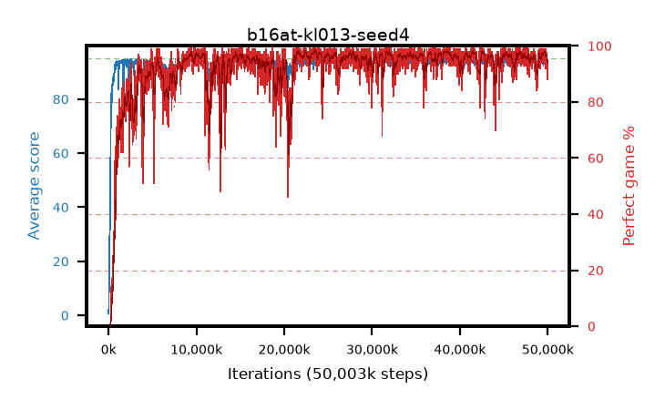

# b16at-kl013-seed4

step **50,003,968** · 3052 evals · trailing **94.04** · peak **94.53** @38,600,704 · sef **92.0** · best30 **98.0** @38,551,552

## Config

| | |
|---|---|
| algo | ppo |
| collect_envs | 128 |
| discount | 0.99 |
| eval_interval | 16384 |
| eval_queue | True |
| eval_queue_depth | 16 |
| eval_workers | 8 |
| fc_layers | (320,) |
| graph_eval_episodes | 100 |
| max_steps | 50003968 |
| min_checkpoint_score | 40.0 |
| ppo_adam_epsilon | 1e-07 |
| ppo_anneal_fraction | 1.0 |
| ppo_clip | 0.2 |
| ppo_clip_final | None |
| ppo_entropy_coef | 0.01 |
| ppo_entropy_coef_final | None |
| ppo_epochs | 4 |
| ppo_gae_lambda | 0.98 |
| ppo_gradient_clipping | 0.5 |
| ppo_horizon | 33.6 |
| ppo_learning_rate | 0.0003 |
| ppo_learning_rate_final | None |
| ppo_minibatch | 256 |
| ppo_normalize_adv | True |
| ppo_rollout | 128 |
| ppo_target_kl | 0.013 |
| ppo_transitions_per_rollout | 16384 |
| ppo_value_loss | huber |
| ppo_vf_coef | 0.5 |
| seed | 4 |
| torch_threads | 1 |

## Evals

| step | avg score | trailing avg | min score | max score | avg reward | perfect % | epsilon |
|---|---|---|---|---|---|---|---|
| 16384 | 0.67 | 5.66 | 0.0 | 3.0 | 0.009 | 0.0 |  |
| 32768 | 3.34 | 3.34 | 2.0 | 11.0 | -1.627 | 0.0 |  |
| 49152 | 12.98 | 8.16 | 2.0 | 35.0 | 7.975 | 0.0 |  |
| ... | ... | ... | ... | ... | ... | ... | ... |
| 49823744 | 94.52 | 94.14 | 57.0 | 95.0 | 190.235 | 97.0 |  |
| 49840128 | 93.27 | 94.1 | 14.0 | 95.0 | 187.959 | 96.0 |  |
| 49856512 | 93.99 | 94.07 | 60.0 | 95.0 | 187.71 | 95.0 |  |
| 49872896 | 93.67 | 94.09 | 61.0 | 95.0 | 187.396 | 95.0 |  |
| 49889280 | 94.22 | 94.15 | 58.0 | 95.0 | 188.926 | 96.0 |  |
| 49905664 | 94.57 | 94.09 | 77.0 | 95.0 | 189.278 | 96.0 |  |
| 49922048 | 94.3 | 94.1 | 81.0 | 95.0 | 187.016 | 94.0 |  |
| 49938432 | 93.41 | 94.07 | 76.0 | 95.0 | 180.144 | 88.0 |  |
| 49954816 | 94.05 | 94.05 | 57.0 | 95.0 | 187.736 | 95.0 |  |
| 49971200 | 94.07 | 94.02 | 64.0 | 95.0 | 187.781 | 95.0 |  |
| 49987584 | 92.47 | 94.01 | 30.0 | 95.0 | 182.189 | 91.0 |  |
| 50003968 | 93.67 | 94.04 | 8.0 | 95.0 | 186.372 | 94.0 |  |
