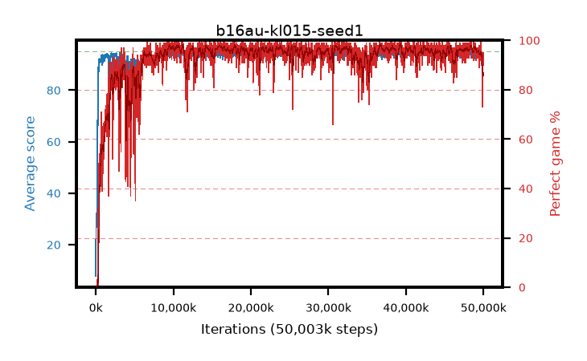

# b16au-kl015-seed1

step **50,003,968** · 3052 evals · trailing **93.19** · peak **94.63** @39,190,528 · sef **93.9** · best30 **97.6** @16,089,088

## Config

| | |
|---|---|
| algo | ppo |
| collect_envs | 128 |
| discount | 0.99 |
| eval_interval | 16384 |
| eval_queue | True |
| eval_queue_depth | 16 |
| eval_workers | 8 |
| fc_layers | (320,) |
| graph_eval_episodes | 100 |
| max_steps | 50003968 |
| min_checkpoint_score | 40.0 |
| ppo_adam_epsilon | 1e-07 |
| ppo_anneal_fraction | 1.0 |
| ppo_clip | 0.2 |
| ppo_clip_final | None |
| ppo_entropy_coef | 0.01 |
| ppo_entropy_coef_final | None |
| ppo_epochs | 4 |
| ppo_gae_lambda | 0.98 |
| ppo_gradient_clipping | 0.5 |
| ppo_horizon | 33.6 |
| ppo_learning_rate | 0.0003 |
| ppo_learning_rate_final | None |
| ppo_minibatch | 256 |
| ppo_normalize_adv | True |
| ppo_rollout | 128 |
| ppo_target_kl | 0.015 |
| ppo_transitions_per_rollout | 16384 |
| ppo_value_loss | huber |
| ppo_vf_coef | 0.5 |
| seed | 1 |
| torch_threads | 1 |

## Evals

| step | avg score | trailing avg | min score | max score | avg reward | perfect % | epsilon |
|---|---|---|---|---|---|---|---|
| 16384 | 7.84 | 7.84 | 0.0 | 20.0 | 6.743 | 0.0 |  |
| 32768 | 31.38 | 24.63 | 11.0 | 58.0 | 26.343 | 0.0 |  |
| 49152 | 32.34 | 22.38 | 3.0 | 60.0 | 27.368 | 0.0 |  |
| ... | ... | ... | ... | ... | ... | ... | ... |
| 49823744 | 92.13 | 93.84 | 20.0 | 95.0 | 177.791 | 87.0 |  |
| 49840128 | 92.91 | 93.77 | 30.0 | 95.0 | 178.525 | 87.0 |  |
| 49856512 | 90.44 | 93.27 | 61.0 | 95.0 | 162.066 | 73.0 |  |
| 49872896 | 90.66 | 93.44 | 65.0 | 95.0 | 164.368 | 75.0 |  |
| 49889280 | 89.62 | 93.6 | 11.0 | 95.0 | 163.336 | 75.0 |  |
| 49905664 | 93.14 | 93.73 | 64.0 | 95.0 | 180.81 | 89.0 |  |
| 49922048 | 93.02 | 93.72 | 7.0 | 95.0 | 186.703 | 95.0 |  |
| 49938432 | 93.58 | 93.42 | 64.0 | 95.0 | 185.275 | 93.0 |  |
| 49954816 | 93.48 | 93.39 | 22.0 | 95.0 | 184.157 | 92.0 |  |
| 49971200 | 92.79 | 93.21 | 24.0 | 95.0 | 182.407 | 91.0 |  |
| 49987584 | 93.33 | 93.18 | 68.0 | 95.0 | 181.998 | 90.0 |  |
| 50003968 | 93.82 | 93.19 | 20.0 | 95.0 | 187.493 | 95.0 |  |
