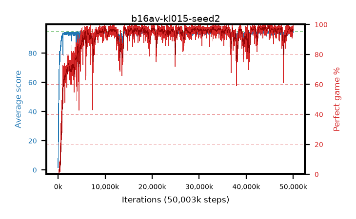

# b16av-kl015-seed2

step **50,003,968** · 3052 evals · trailing **94.07** · peak **94.53** @43,679,744 · sef **90.0** · best30 **98.0** @44,859,392

## Config

| | |
|---|---|
| algo | ppo |
| collect_envs | 128 |
| discount | 0.99 |
| eval_interval | 16384 |
| eval_queue | True |
| eval_queue_depth | 16 |
| eval_workers | 8 |
| fc_layers | (320,) |
| graph_eval_episodes | 100 |
| max_steps | 50003968 |
| min_checkpoint_score | 40.0 |
| ppo_adam_epsilon | 1e-07 |
| ppo_anneal_fraction | 1.0 |
| ppo_clip | 0.2 |
| ppo_clip_final | None |
| ppo_entropy_coef | 0.01 |
| ppo_entropy_coef_final | None |
| ppo_epochs | 4 |
| ppo_gae_lambda | 0.98 |
| ppo_gradient_clipping | 0.5 |
| ppo_horizon | 33.6 |
| ppo_learning_rate | 0.0003 |
| ppo_learning_rate_final | None |
| ppo_minibatch | 256 |
| ppo_normalize_adv | True |
| ppo_rollout | 128 |
| ppo_target_kl | 0.015 |
| ppo_transitions_per_rollout | 16384 |
| ppo_value_loss | huber |
| ppo_vf_coef | 0.5 |
| seed | 2 |
| torch_threads | 1 |

## Evals

| step | avg score | trailing avg | min score | max score | avg reward | perfect % | epsilon |
|---|---|---|---|---|---|---|---|
| 16384 | 1.69 | 1.69 | 0.0 | 5.0 | -1.139 | 0.0 |  |
| 32768 | 12.03 | 6.86 | 0.0 | 25.0 | 7.121 | 0.0 |  |
| 49152 | 22.47 | 15.36 | 7.0 | 43.0 | 17.438 | 0.0 |  |
| ... | ... | ... | ... | ... | ... | ... | ... |
| 49823744 | 94.34 | 94.09 | 63.0 | 95.0 | 190.052 | 97.0 |  |
| 49840128 | 94.9 | 94.04 | 90.0 | 95.0 | 191.617 | 98.0 |  |
| 49856512 | 93.86 | 94.07 | 10.0 | 95.0 | 188.581 | 96.0 |  |
| 49872896 | 93.65 | 93.99 | 10.0 | 95.0 | 187.368 | 95.0 |  |
| 49889280 | 91.61 | 94.04 | 6.0 | 95.0 | 183.356 | 93.0 |  |
| 49905664 | 94.55 | 94.01 | 67.0 | 95.0 | 190.259 | 97.0 |  |
| 49922048 | 94.69 | 94.09 | 75.0 | 95.0 | 190.414 | 97.0 |  |
| 49938432 | 93.95 | 94.07 | 20.0 | 95.0 | 190.674 | 98.0 |  |
| 49954816 | 95.0 | 94.13 | 95.0 | 95.0 | 193.713 | 100.0 |  |
| 49971200 | 94.25 | 94.06 | 68.0 | 95.0 | 188.965 | 96.0 |  |
| 49987584 | 94.22 | 94.05 | 24.0 | 95.0 | 190.937 | 98.0 |  |
| 50003968 | 94.52 | 94.07 | 77.0 | 95.0 | 189.247 | 96.0 |  |
