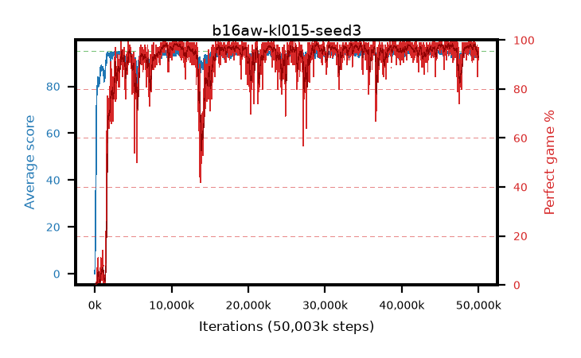

# b16aw-kl015-seed3

step **50,003,968** · 3052 evals · trailing **94.09** · peak **94.62** @45,056,000 · sef **91.5** · best30 **98.3** @10,715,136

## Config

| | |
|---|---|
| algo | ppo |
| collect_envs | 128 |
| discount | 0.99 |
| eval_interval | 16384 |
| eval_queue | True |
| eval_queue_depth | 16 |
| eval_workers | 8 |
| fc_layers | (320,) |
| graph_eval_episodes | 100 |
| max_steps | 50003968 |
| min_checkpoint_score | 40.0 |
| ppo_adam_epsilon | 1e-07 |
| ppo_anneal_fraction | 1.0 |
| ppo_clip | 0.2 |
| ppo_clip_final | None |
| ppo_entropy_coef | 0.01 |
| ppo_entropy_coef_final | None |
| ppo_epochs | 4 |
| ppo_gae_lambda | 0.98 |
| ppo_gradient_clipping | 0.5 |
| ppo_horizon | 33.6 |
| ppo_learning_rate | 0.0003 |
| ppo_learning_rate_final | None |
| ppo_minibatch | 256 |
| ppo_normalize_adv | True |
| ppo_rollout | 128 |
| ppo_target_kl | 0.015 |
| ppo_transitions_per_rollout | 16384 |
| ppo_value_loss | huber |
| ppo_vf_coef | 0.5 |
| seed | 3 |
| torch_threads | 1 |

## Evals

| step | avg score | trailing avg | min score | max score | avg reward | perfect % | epsilon |
|---|---|---|---|---|---|---|---|
| 16384 | 0.01 | 0.01 | 0.0 | 1.0 | -4.413 | 0.0 |  |
| 32768 | 2.61 | 1.31 | 0.0 | 13.0 | 1.316 | 0.0 |  |
| 49152 | 18.92 | 7.18 | 3.0 | 35.0 | 14.019 | 0.0 |  |
| ... | ... | ... | ... | ... | ... | ... | ... |
| 49823744 | 94.28 | 94.31 | 71.0 | 95.0 | 188.976 | 96.0 |  |
| 49840128 | 93.3 | 94.32 | 19.0 | 95.0 | 186.98 | 95.0 |  |
| 49856512 | 93.68 | 94.28 | 77.0 | 95.0 | 178.415 | 86.0 |  |
| 49872896 | 94.15 | 94.28 | 75.0 | 95.0 | 185.857 | 93.0 |  |
| 49889280 | 92.28 | 94.22 | 34.0 | 95.0 | 176.016 | 85.0 |  |
| 49905664 | 92.7 | 94.09 | 8.0 | 95.0 | 184.432 | 93.0 |  |
| 49922048 | 94.02 | 94.2 | 55.0 | 95.0 | 187.735 | 95.0 |  |
| 49938432 | 94.46 | 94.09 | 67.0 | 95.0 | 190.173 | 97.0 |  |
| 49954816 | 93.95 | 94.09 | 24.0 | 95.0 | 188.663 | 96.0 |  |
| 49971200 | 93.51 | 94.17 | 73.0 | 95.0 | 184.218 | 92.0 |  |
| 49987584 | 94.47 | 94.13 | 79.0 | 95.0 | 189.189 | 96.0 |  |
| 50003968 | 94.52 | 94.09 | 75.0 | 95.0 | 189.236 | 96.0 |  |
