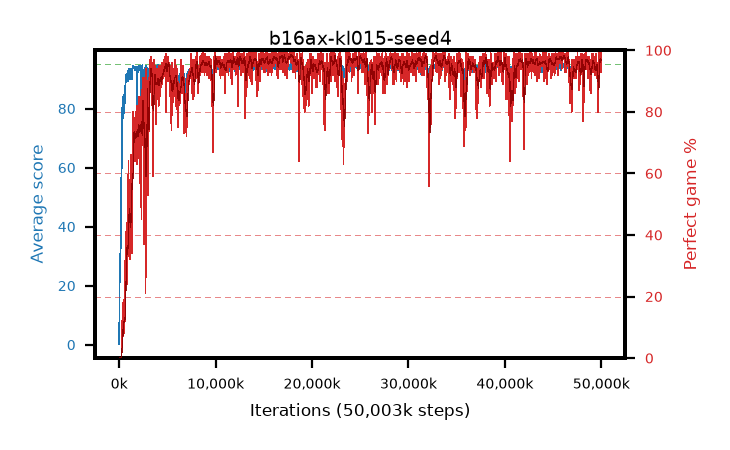

# b16ax-kl015-seed4

step **50,003,968** · 3052 evals · trailing **93.79** · peak **94.56** @17,072,128 · sef **93.0** · best30 **98.0** @17,874,944

## Config

| | |
|---|---|
| algo | ppo |
| collect_envs | 128 |
| discount | 0.99 |
| eval_interval | 16384 |
| eval_queue | True |
| eval_queue_depth | 16 |
| eval_workers | 8 |
| fc_layers | (320,) |
| graph_eval_episodes | 100 |
| max_steps | 50003968 |
| min_checkpoint_score | 40.0 |
| ppo_adam_epsilon | 1e-07 |
| ppo_anneal_fraction | 1.0 |
| ppo_clip | 0.2 |
| ppo_clip_final | None |
| ppo_entropy_coef | 0.01 |
| ppo_entropy_coef_final | None |
| ppo_epochs | 4 |
| ppo_gae_lambda | 0.98 |
| ppo_gradient_clipping | 0.5 |
| ppo_horizon | 33.6 |
| ppo_learning_rate | 0.0003 |
| ppo_learning_rate_final | None |
| ppo_minibatch | 256 |
| ppo_normalize_adv | True |
| ppo_rollout | 128 |
| ppo_target_kl | 0.015 |
| ppo_transitions_per_rollout | 16384 |
| ppo_value_loss | huber |
| ppo_vf_coef | 0.5 |
| seed | 4 |
| torch_threads | 1 |

## Evals

| step | avg score | trailing avg | min score | max score | avg reward | perfect % | epsilon |
|---|---|---|---|---|---|---|---|
| 16384 | 0.2 | 0.2 | 0.0 | 2.0 | -0.617 | 0.0 |  |
| 32768 | 18.93 | 9.56 | 3.0 | 35.0 | 13.888 | 0.0 |  |
| 49152 | 25.03 | 14.72 | 8.0 | 42.0 | 20.004 | 0.0 |  |
| ... | ... | ... | ... | ... | ... | ... | ... |
| 49823744 | 94.49 | 93.81 | 62.0 | 95.0 | 190.215 | 97.0 |  |
| 49840128 | 94.86 | 93.83 | 81.0 | 95.0 | 192.571 | 99.0 |  |
| 49856512 | 94.78 | 93.79 | 73.0 | 95.0 | 192.494 | 99.0 |  |
| 49872896 | 93.23 | 93.8 | 8.0 | 95.0 | 187.946 | 96.0 |  |
| 49889280 | 94.02 | 93.82 | 18.0 | 95.0 | 189.73 | 97.0 |  |
| 49905664 | 94.49 | 93.82 | 60.0 | 95.0 | 190.151 | 97.0 |  |
| 49922048 | 93.91 | 93.79 | 6.0 | 95.0 | 189.585 | 97.0 |  |
| 49938432 | 94.34 | 93.78 | 57.0 | 95.0 | 190.01 | 97.0 |  |
| 49954816 | 93.23 | 93.75 | 10.0 | 95.0 | 186.942 | 95.0 |  |
| 49971200 | 93.82 | 93.82 | 48.0 | 95.0 | 185.47 | 93.0 |  |
| 49987584 | 94.19 | 93.8 | 60.0 | 95.0 | 189.907 | 97.0 |  |
| 50003968 | 94.85 | 93.79 | 80.0 | 95.0 | 192.551 | 99.0 |  |
