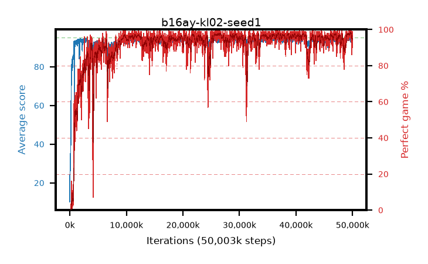

# b16ay-kl02-seed1

step **50,003,968** · 3052 evals · trailing **94.03** · peak **94.44** @36,831,232 · sef **91.9** · best30 **97.9** @49,758,208

## Config

| | |
|---|---|
| algo | ppo |
| collect_envs | 128 |
| discount | 0.99 |
| eval_interval | 16384 |
| eval_queue | True |
| eval_queue_depth | 16 |
| eval_workers | 8 |
| fc_layers | (320,) |
| graph_eval_episodes | 100 |
| max_steps | 50003968 |
| min_checkpoint_score | 40.0 |
| ppo_adam_epsilon | 1e-07 |
| ppo_anneal_fraction | 1.0 |
| ppo_clip | 0.2 |
| ppo_clip_final | None |
| ppo_entropy_coef | 0.01 |
| ppo_entropy_coef_final | None |
| ppo_epochs | 4 |
| ppo_gae_lambda | 0.98 |
| ppo_gradient_clipping | 0.5 |
| ppo_horizon | 33.6 |
| ppo_learning_rate | 0.0003 |
| ppo_learning_rate_final | None |
| ppo_minibatch | 256 |
| ppo_normalize_adv | True |
| ppo_rollout | 128 |
| ppo_target_kl | 0.02 |
| ppo_transitions_per_rollout | 16384 |
| ppo_value_loss | huber |
| ppo_vf_coef | 0.5 |
| seed | 1 |
| torch_threads | 1 |

## Evals

| step | avg score | trailing avg | min score | max score | avg reward | perfect % | epsilon |
|---|---|---|---|---|---|---|---|
| 16384 | 10.17 | 26.38 | 0.0 | 32.0 | 8.748 | 0.0 |  |
| 32768 | 33.85 | 29.14 | 3.0 | 68.0 | 28.825 | 0.0 |  |
| 49152 | 26.04 | 26.04 | 5.0 | 52.0 | 21.186 | 0.0 |  |
| ... | ... | ... | ... | ... | ... | ... | ... |
| 49823744 | 94.41 | 94.23 | 78.0 | 95.0 | 189.126 | 96.0 |  |
| 49840128 | 94.69 | 94.23 | 72.0 | 95.0 | 190.363 | 97.0 |  |
| 49856512 | 94.36 | 94.22 | 79.0 | 95.0 | 187.093 | 94.0 |  |
| 49872896 | 89.43 | 94.05 | 1.0 | 95.0 | 174.147 | 86.0 |  |
| 49889280 | 94.29 | 94.04 | 53.0 | 95.0 | 189.015 | 96.0 |  |
| 49905664 | 94.16 | 94.06 | 44.0 | 95.0 | 189.84 | 97.0 |  |
| 49922048 | 94.38 | 94.25 | 52.0 | 95.0 | 191.108 | 98.0 |  |
| 49938432 | 94.69 | 94.26 | 64.0 | 95.0 | 192.41 | 99.0 |  |
| 49954816 | 93.41 | 94.22 | 30.0 | 95.0 | 184.103 | 92.0 |  |
| 49971200 | 94.38 | 94.24 | 68.0 | 95.0 | 189.095 | 96.0 |  |
| 49987584 | 92.67 | 94.2 | 4.0 | 95.0 | 181.279 | 90.0 |  |
| 50003968 | 93.98 | 94.03 | 62.0 | 95.0 | 185.699 | 93.0 |  |
