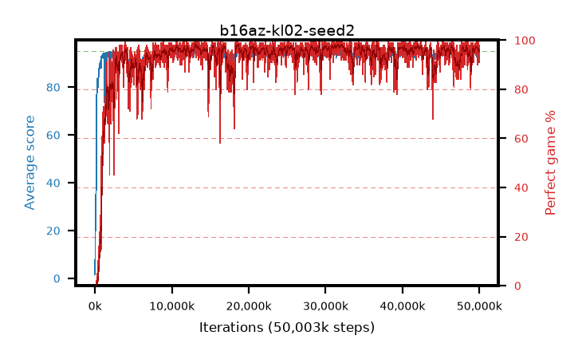

# b16az-kl02-seed2

step **50,003,968** · 3052 evals · trailing **94.35** · peak **94.49** @32,096,256 · sef **94.6** · best30 **97.8** @32,014,336

## Config

| | |
|---|---|
| algo | ppo |
| collect_envs | 128 |
| discount | 0.99 |
| eval_interval | 16384 |
| eval_queue | True |
| eval_queue_depth | 16 |
| eval_workers | 8 |
| fc_layers | (320,) |
| graph_eval_episodes | 100 |
| max_steps | 50003968 |
| min_checkpoint_score | 40.0 |
| ppo_adam_epsilon | 1e-07 |
| ppo_anneal_fraction | 1.0 |
| ppo_clip | 0.2 |
| ppo_clip_final | None |
| ppo_entropy_coef | 0.01 |
| ppo_entropy_coef_final | None |
| ppo_epochs | 4 |
| ppo_gae_lambda | 0.98 |
| ppo_gradient_clipping | 0.5 |
| ppo_horizon | 33.6 |
| ppo_learning_rate | 0.0003 |
| ppo_learning_rate_final | None |
| ppo_minibatch | 256 |
| ppo_normalize_adv | True |
| ppo_rollout | 128 |
| ppo_target_kl | 0.02 |
| ppo_transitions_per_rollout | 16384 |
| ppo_value_loss | huber |
| ppo_vf_coef | 0.5 |
| seed | 2 |
| torch_threads | 1 |

## Evals

| step | avg score | trailing avg | min score | max score | avg reward | perfect % | epsilon |
|---|---|---|---|---|---|---|---|
| 16384 | 1.6 | 1.6 | 0.0 | 6.0 | -0.871 | 0.0 |  |
| 32768 | 12.02 | 6.81 | 0.0 | 29.0 | 7.202 | 0.0 |  |
| 49152 | 23.4 | 17.18 | 6.0 | 46.0 | 18.361 | 0.0 |  |
| ... | ... | ... | ... | ... | ... | ... | ... |
| 49823744 | 94.71 | 94.37 | 86.0 | 95.0 | 189.431 | 96.0 |  |
| 49840128 | 94.49 | 94.34 | 67.0 | 95.0 | 189.226 | 96.0 |  |
| 49856512 | 94.43 | 94.36 | 68.0 | 95.0 | 190.153 | 97.0 |  |
| 49872896 | 95.0 | 94.35 | 95.0 | 95.0 | 193.711 | 100.0 |  |
| 49889280 | 94.59 | 94.36 | 66.0 | 95.0 | 190.314 | 97.0 |  |
| 49905664 | 93.55 | 94.33 | 14.0 | 95.0 | 188.288 | 96.0 |  |
| 49922048 | 93.28 | 94.3 | 26.0 | 95.0 | 183.026 | 91.0 |  |
| 49938432 | 93.92 | 94.28 | 59.0 | 95.0 | 183.597 | 91.0 |  |
| 49954816 | 94.04 | 94.28 | 18.0 | 95.0 | 190.762 | 98.0 |  |
| 49971200 | 93.44 | 94.35 | 61.0 | 95.0 | 185.184 | 93.0 |  |
| 49987584 | 94.82 | 94.35 | 82.0 | 95.0 | 191.549 | 98.0 |  |
| 50003968 | 94.25 | 94.35 | 37.0 | 95.0 | 190.929 | 98.0 |  |
