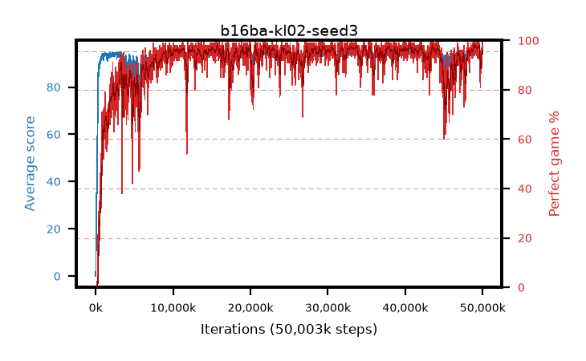

# b16ba-kl02-seed3

step **50,003,968** · 3052 evals · trailing **93.84** · peak **94.51** @49,233,920 · sef **90.9** · best30 **97.6** @49,168,384

## Config

| | |
|---|---|
| algo | ppo |
| collect_envs | 128 |
| discount | 0.99 |
| eval_interval | 16384 |
| eval_queue | True |
| eval_queue_depth | 16 |
| eval_workers | 8 |
| fc_layers | (320,) |
| graph_eval_episodes | 100 |
| max_steps | 50003968 |
| min_checkpoint_score | 40.0 |
| ppo_adam_epsilon | 1e-07 |
| ppo_anneal_fraction | 1.0 |
| ppo_clip | 0.2 |
| ppo_clip_final | None |
| ppo_entropy_coef | 0.01 |
| ppo_entropy_coef_final | None |
| ppo_epochs | 4 |
| ppo_gae_lambda | 0.98 |
| ppo_gradient_clipping | 0.5 |
| ppo_horizon | 33.6 |
| ppo_learning_rate | 0.0003 |
| ppo_learning_rate_final | None |
| ppo_minibatch | 256 |
| ppo_normalize_adv | True |
| ppo_rollout | 128 |
| ppo_target_kl | 0.02 |
| ppo_transitions_per_rollout | 16384 |
| ppo_value_loss | huber |
| ppo_vf_coef | 0.5 |
| seed | 3 |
| torch_threads | 1 |

## Evals

| step | avg score | trailing avg | min score | max score | avg reward | perfect % | epsilon |
|---|---|---|---|---|---|---|---|
| 16384 | 0.02 | 0.02 | 0.0 | 1.0 | -4.403 | 0.0 |  |
| 32768 | 3.22 | 1.62 | 0.0 | 11.0 | 1.563 | 0.0 |  |
| 49152 | 20.47 | 7.9 | 7.0 | 40.0 | 15.529 | 0.0 |  |
| ... | ... | ... | ... | ... | ... | ... | ... |
| 49823744 | 93.17 | 94.02 | 70.0 | 95.0 | 180.903 | 89.0 |  |
| 49840128 | 94.32 | 94.0 | 61.0 | 95.0 | 189.037 | 96.0 |  |
| 49856512 | 92.64 | 93.93 | 20.0 | 95.0 | 181.376 | 90.0 |  |
| 49872896 | 94.69 | 93.95 | 82.0 | 95.0 | 189.418 | 96.0 |  |
| 49889280 | 92.97 | 93.9 | 10.0 | 95.0 | 186.703 | 95.0 |  |
| 49905664 | 94.1 | 93.88 | 20.0 | 95.0 | 189.826 | 97.0 |  |
| 49922048 | 93.86 | 93.84 | 8.0 | 95.0 | 189.586 | 97.0 |  |
| 49938432 | 94.83 | 93.84 | 78.0 | 95.0 | 192.554 | 99.0 |  |
| 49954816 | 94.23 | 93.83 | 61.0 | 95.0 | 189.95 | 97.0 |  |
| 49971200 | 94.26 | 93.81 | 26.0 | 95.0 | 190.979 | 98.0 |  |
| 49987584 | 94.67 | 93.83 | 81.0 | 95.0 | 189.417 | 96.0 |  |
| 50003968 | 94.73 | 93.84 | 68.0 | 95.0 | 192.451 | 99.0 |  |
