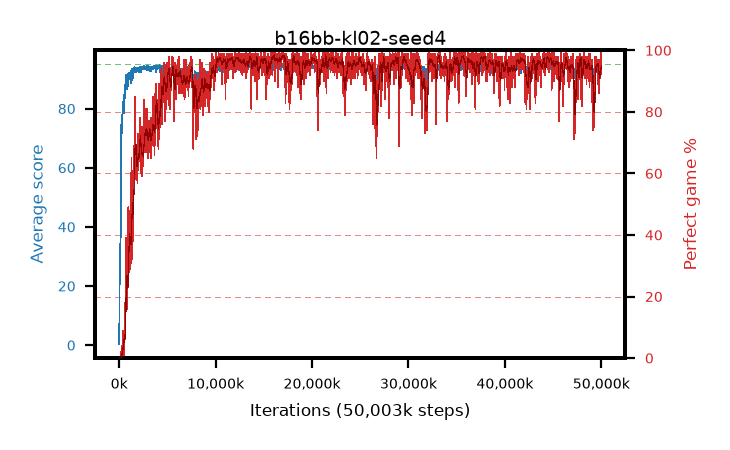

# b16bb-kl02-seed4

step **50,003,968** · 3052 evals · trailing **93.76** · peak **94.53** @35,028,992 · sef **90.6** · best30 **97.8** @17,186,816

## Config

| | |
|---|---|
| algo | ppo |
| collect_envs | 128 |
| discount | 0.99 |
| eval_interval | 16384 |
| eval_queue | True |
| eval_queue_depth | 16 |
| eval_workers | 8 |
| fc_layers | (320,) |
| graph_eval_episodes | 100 |
| max_steps | 50003968 |
| min_checkpoint_score | 40.0 |
| ppo_adam_epsilon | 1e-07 |
| ppo_anneal_fraction | 1.0 |
| ppo_clip | 0.2 |
| ppo_clip_final | None |
| ppo_entropy_coef | 0.01 |
| ppo_entropy_coef_final | None |
| ppo_epochs | 4 |
| ppo_gae_lambda | 0.98 |
| ppo_gradient_clipping | 0.5 |
| ppo_horizon | 33.6 |
| ppo_learning_rate | 0.0003 |
| ppo_learning_rate_final | None |
| ppo_minibatch | 256 |
| ppo_normalize_adv | True |
| ppo_rollout | 128 |
| ppo_target_kl | 0.02 |
| ppo_transitions_per_rollout | 16384 |
| ppo_value_loss | huber |
| ppo_vf_coef | 0.5 |
| seed | 4 |
| torch_threads | 1 |

## Evals

| step | avg score | trailing avg | min score | max score | avg reward | perfect % | epsilon |
|---|---|---|---|---|---|---|---|
| 16384 | 0.36 | 0.36 | 0.0 | 4.0 | -0.636 | 0.0 |  |
| 32768 | 18.25 | 9.3 | 3.0 | 33.0 | 13.214 | 0.0 |  |
| 49152 | 24.44 | 14.35 | 5.0 | 51.0 | 19.415 | 0.0 |  |
| ... | ... | ... | ... | ... | ... | ... | ... |
| 49823744 | 94.0 | 93.78 | 59.0 | 95.0 | 186.718 | 94.0 |  |
| 49840128 | 94.57 | 93.82 | 81.0 | 95.0 | 188.294 | 95.0 |  |
| 49856512 | 93.17 | 93.78 | 8.0 | 95.0 | 183.889 | 92.0 |  |
| 49872896 | 92.3 | 93.79 | 12.0 | 95.0 | 183.992 | 93.0 |  |
| 49889280 | 94.71 | 93.73 | 82.0 | 95.0 | 190.411 | 97.0 |  |
| 49905664 | 94.42 | 93.71 | 81.0 | 95.0 | 187.124 | 94.0 |  |
| 49922048 | 94.06 | 93.74 | 76.0 | 95.0 | 183.771 | 91.0 |  |
| 49938432 | 93.96 | 93.71 | 10.0 | 95.0 | 188.662 | 96.0 |  |
| 49954816 | 94.55 | 93.79 | 81.0 | 95.0 | 186.201 | 93.0 |  |
| 49971200 | 93.95 | 93.81 | 3.0 | 95.0 | 190.644 | 98.0 |  |
| 49987584 | 94.6 | 93.79 | 84.0 | 95.0 | 189.311 | 96.0 |  |
| 50003968 | 94.55 | 93.76 | 50.0 | 95.0 | 192.207 | 99.0 |  |
