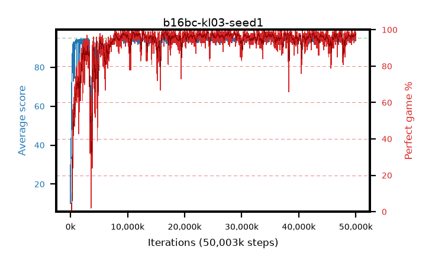

# b16bc-kl03-seed1

step **50,003,968** · 3052 evals · trailing **94.42** · peak **94.52** @49,496,064 · sef **93.6** · best30 **98.2** @11,141,120

## Config

| | |
|---|---|
| algo | ppo |
| collect_envs | 128 |
| discount | 0.99 |
| eval_interval | 16384 |
| eval_queue | True |
| eval_queue_depth | 16 |
| eval_workers | 8 |
| fc_layers | (320,) |
| graph_eval_episodes | 100 |
| max_steps | 50003968 |
| min_checkpoint_score | 40.0 |
| ppo_adam_epsilon | 1e-07 |
| ppo_anneal_fraction | 1.0 |
| ppo_clip | 0.2 |
| ppo_clip_final | None |
| ppo_entropy_coef | 0.01 |
| ppo_entropy_coef_final | None |
| ppo_epochs | 4 |
| ppo_gae_lambda | 0.98 |
| ppo_gradient_clipping | 0.5 |
| ppo_horizon | 33.6 |
| ppo_learning_rate | 0.0003 |
| ppo_learning_rate_final | None |
| ppo_minibatch | 256 |
| ppo_normalize_adv | True |
| ppo_rollout | 128 |
| ppo_target_kl | 0.03 |
| ppo_transitions_per_rollout | 16384 |
| ppo_value_loss | huber |
| ppo_vf_coef | 0.5 |
| seed | 1 |
| torch_threads | 1 |

## Evals

| step | avg score | trailing avg | min score | max score | avg reward | perfect % | epsilon |
|---|---|---|---|---|---|---|---|
| 16384 | 10.09 | 28.52 | 0.0 | 39.0 | 8.793 | 0.0 |  |
| 32768 | 43.47 | 31.51 | 11.0 | 92.0 | 38.407 | 0.0 |  |
| 49152 | 34.6 | 34.66 | 10.0 | 76.0 | 29.523 | 0.0 |  |
| ... | ... | ... | ... | ... | ... | ... | ... |
| 49823744 | 94.07 | 94.42 | 66.0 | 95.0 | 188.794 | 96.0 |  |
| 49840128 | 93.76 | 94.44 | 24.0 | 95.0 | 188.485 | 96.0 |  |
| 49856512 | 94.73 | 94.43 | 71.0 | 95.0 | 191.45 | 98.0 |  |
| 49872896 | 94.66 | 94.44 | 67.0 | 95.0 | 190.35 | 97.0 |  |
| 49889280 | 94.9 | 94.45 | 85.0 | 95.0 | 192.594 | 99.0 |  |
| 49905664 | 95.0 | 94.48 | 95.0 | 95.0 | 193.701 | 100.0 |  |
| 49922048 | 94.91 | 94.48 | 86.0 | 95.0 | 192.614 | 99.0 |  |
| 49938432 | 94.76 | 94.46 | 83.0 | 95.0 | 191.469 | 98.0 |  |
| 49954816 | 94.62 | 94.48 | 82.0 | 95.0 | 188.334 | 95.0 |  |
| 49971200 | 93.94 | 94.42 | 37.0 | 95.0 | 189.606 | 97.0 |  |
| 49987584 | 94.0 | 94.47 | 63.0 | 95.0 | 186.72 | 94.0 |  |
| 50003968 | 94.83 | 94.42 | 89.0 | 95.0 | 189.499 | 96.0 |  |
