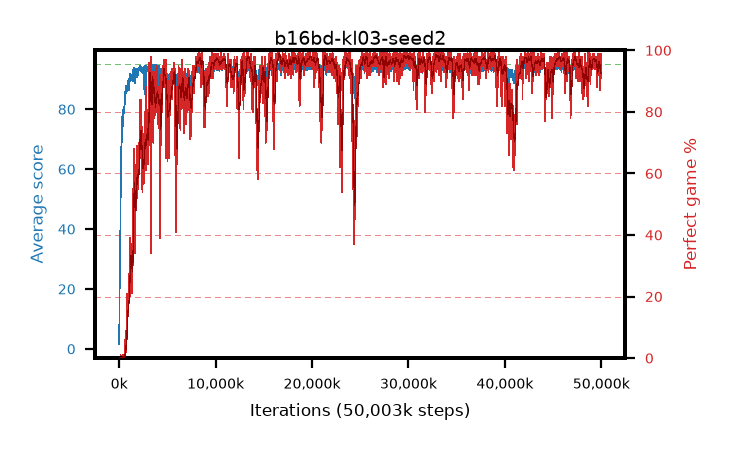

# b16bd-kl03-seed2

step **50,003,968** · 3052 evals · trailing **93.94** · peak **94.67** @33,030,144 · sef **88.6** · best30 **98.0** @29,884,416

## Config

| | |
|---|---|
| algo | ppo |
| collect_envs | 128 |
| discount | 0.99 |
| eval_interval | 16384 |
| eval_queue | True |
| eval_queue_depth | 16 |
| eval_workers | 8 |
| fc_layers | (320,) |
| graph_eval_episodes | 100 |
| max_steps | 50003968 |
| min_checkpoint_score | 40.0 |
| ppo_adam_epsilon | 1e-07 |
| ppo_anneal_fraction | 1.0 |
| ppo_clip | 0.2 |
| ppo_clip_final | None |
| ppo_entropy_coef | 0.01 |
| ppo_entropy_coef_final | None |
| ppo_epochs | 4 |
| ppo_gae_lambda | 0.98 |
| ppo_gradient_clipping | 0.5 |
| ppo_horizon | 33.6 |
| ppo_learning_rate | 0.0003 |
| ppo_learning_rate_final | None |
| ppo_minibatch | 256 |
| ppo_normalize_adv | True |
| ppo_rollout | 128 |
| ppo_target_kl | 0.03 |
| ppo_transitions_per_rollout | 16384 |
| ppo_value_loss | huber |
| ppo_vf_coef | 0.5 |
| seed | 2 |
| torch_threads | 1 |

## Evals

| step | avg score | trailing avg | min score | max score | avg reward | perfect % | epsilon |
|---|---|---|---|---|---|---|---|
| 16384 | 1.59 | 1.59 | 0.0 | 6.0 | -0.703 | 0.0 |  |
| 32768 | 14.95 | 8.27 | 4.0 | 28.0 | 9.989 | 0.0 |  |
| 49152 | 23.82 | 16.2 | 9.0 | 43.0 | 18.869 | 0.0 |  |
| ... | ... | ... | ... | ... | ... | ... | ... |
| 49823744 | 94.83 | 94.21 | 87.0 | 95.0 | 190.548 | 97.0 |  |
| 49840128 | 93.51 | 94.19 | 28.0 | 95.0 | 183.201 | 91.0 |  |
| 49856512 | 93.41 | 94.13 | 14.0 | 95.0 | 182.146 | 90.0 |  |
| 49872896 | 93.28 | 94.18 | 62.0 | 95.0 | 178.993 | 87.0 |  |
| 49889280 | 93.05 | 94.08 | 18.0 | 95.0 | 178.788 | 87.0 |  |
| 49905664 | 93.61 | 94.05 | 12.0 | 95.0 | 186.332 | 94.0 |  |
| 49922048 | 92.88 | 93.96 | 10.0 | 95.0 | 181.561 | 90.0 |  |
| 49938432 | 93.52 | 94.02 | 18.0 | 95.0 | 185.245 | 93.0 |  |
| 49954816 | 94.7 | 94.04 | 65.0 | 95.0 | 192.404 | 99.0 |  |
| 49971200 | 94.53 | 93.96 | 69.0 | 95.0 | 190.233 | 97.0 |  |
| 49987584 | 93.48 | 93.99 | 8.0 | 95.0 | 188.207 | 96.0 |  |
| 50003968 | 94.14 | 93.94 | 70.0 | 95.0 | 187.856 | 95.0 |  |
