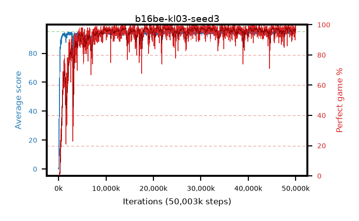

# b16be-kl03-seed3

step **50,003,968** · 3052 evals · trailing **94.4** · peak **94.61** @22,347,776 · sef **94.0** · best30 **98.0** @21,020,672

## Config

| | |
|---|---|
| algo | ppo |
| collect_envs | 128 |
| discount | 0.99 |
| eval_interval | 16384 |
| eval_queue | True |
| eval_queue_depth | 16 |
| eval_workers | 8 |
| fc_layers | (320,) |
| graph_eval_episodes | 100 |
| max_steps | 50003968 |
| min_checkpoint_score | 40.0 |
| ppo_adam_epsilon | 1e-07 |
| ppo_anneal_fraction | 1.0 |
| ppo_clip | 0.2 |
| ppo_clip_final | None |
| ppo_entropy_coef | 0.01 |
| ppo_entropy_coef_final | None |
| ppo_epochs | 4 |
| ppo_gae_lambda | 0.98 |
| ppo_gradient_clipping | 0.5 |
| ppo_horizon | 33.6 |
| ppo_learning_rate | 0.0003 |
| ppo_learning_rate_final | None |
| ppo_minibatch | 256 |
| ppo_normalize_adv | True |
| ppo_rollout | 128 |
| ppo_target_kl | 0.03 |
| ppo_transitions_per_rollout | 16384 |
| ppo_value_loss | huber |
| ppo_vf_coef | 0.5 |
| seed | 3 |
| torch_threads | 1 |

## Evals

| step | avg score | trailing avg | min score | max score | avg reward | perfect % | epsilon |
|---|---|---|---|---|---|---|---|
| 16384 | 0.02 | 0.02 | 0.0 | 1.0 | -4.581 | 0.0 |  |
| 32768 | 1.63 | 0.82 | 0.0 | 8.0 | 1.024 | 0.0 |  |
| 49152 | 18.3 | 10.89 | 0.0 | 33.0 | 13.886 | 0.0 |  |
| ... | ... | ... | ... | ... | ... | ... | ... |
| 49823744 | 94.2 | 94.35 | 72.0 | 95.0 | 186.915 | 94.0 |  |
| 49840128 | 94.66 | 94.32 | 64.0 | 95.0 | 191.327 | 98.0 |  |
| 49856512 | 94.89 | 94.37 | 84.0 | 95.0 | 192.596 | 99.0 |  |
| 49872896 | 94.62 | 94.36 | 81.0 | 95.0 | 190.32 | 97.0 |  |
| 49889280 | 92.64 | 94.34 | 36.0 | 95.0 | 181.268 | 90.0 |  |
| 49905664 | 94.55 | 94.33 | 73.0 | 95.0 | 190.251 | 97.0 |  |
| 49922048 | 94.46 | 94.39 | 71.0 | 95.0 | 186.162 | 93.0 |  |
| 49938432 | 94.88 | 94.38 | 83.0 | 95.0 | 192.564 | 99.0 |  |
| 49954816 | 94.1 | 94.39 | 12.0 | 95.0 | 190.796 | 98.0 |  |
| 49971200 | 95.0 | 94.37 | 95.0 | 95.0 | 193.703 | 100.0 |  |
| 49987584 | 94.8 | 94.36 | 75.0 | 95.0 | 192.496 | 99.0 |  |
| 50003968 | 94.97 | 94.4 | 92.0 | 95.0 | 192.668 | 99.0 |  |
