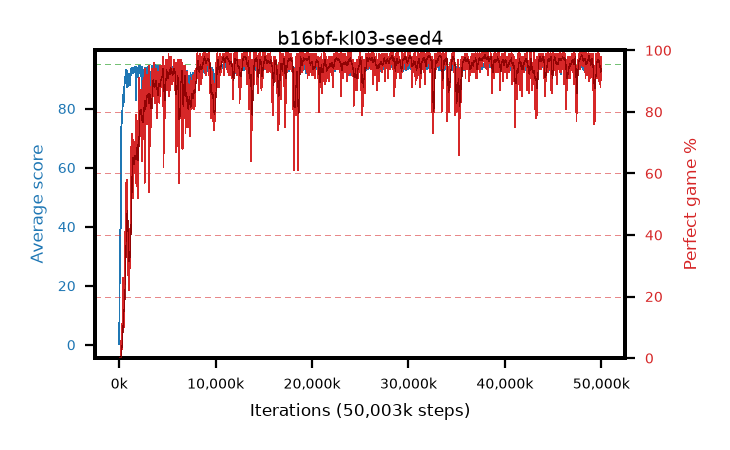

# b16bf-kl03-seed4

step **50,003,968** · 3052 evals · trailing **93.84** · peak **94.63** @38,158,336 · sef **92.9** · best30 **97.9** @38,174,720

## Config

| | |
|---|---|
| algo | ppo |
| collect_envs | 128 |
| discount | 0.99 |
| eval_interval | 16384 |
| eval_queue | True |
| eval_queue_depth | 16 |
| eval_workers | 8 |
| fc_layers | (320,) |
| graph_eval_episodes | 100 |
| max_steps | 50003968 |
| min_checkpoint_score | 40.0 |
| ppo_adam_epsilon | 1e-07 |
| ppo_anneal_fraction | 1.0 |
| ppo_clip | 0.2 |
| ppo_clip_final | None |
| ppo_entropy_coef | 0.01 |
| ppo_entropy_coef_final | None |
| ppo_epochs | 4 |
| ppo_gae_lambda | 0.98 |
| ppo_gradient_clipping | 0.5 |
| ppo_horizon | 33.6 |
| ppo_learning_rate | 0.0003 |
| ppo_learning_rate_final | None |
| ppo_minibatch | 256 |
| ppo_normalize_adv | True |
| ppo_rollout | 128 |
| ppo_target_kl | 0.03 |
| ppo_transitions_per_rollout | 16384 |
| ppo_value_loss | huber |
| ppo_vf_coef | 0.5 |
| seed | 4 |
| torch_threads | 1 |

## Evals

| step | avg score | trailing avg | min score | max score | avg reward | perfect % | epsilon |
|---|---|---|---|---|---|---|---|
| 16384 | 0.25 | 0.25 | 0.0 | 2.0 | -0.657 | 0.0 |  |
| 32768 | 16.82 | 8.54 | 4.0 | 26.0 | 11.923 | 0.0 |  |
| 49152 | 24.88 | 13.98 | 7.0 | 42.0 | 19.848 | 0.0 |  |
| ... | ... | ... | ... | ... | ... | ... | ... |
| 49823744 | 94.31 | 94.26 | 68.0 | 95.0 | 187.931 | 95.0 |  |
| 49840128 | 92.53 | 94.2 | 6.0 | 95.0 | 184.172 | 93.0 |  |
| 49856512 | 93.95 | 94.2 | 56.0 | 95.0 | 186.57 | 94.0 |  |
| 49872896 | 93.48 | 94.19 | 35.0 | 95.0 | 185.058 | 93.0 |  |
| 49889280 | 91.71 | 94.11 | 18.0 | 95.0 | 179.306 | 89.0 |  |
| 49905664 | 92.93 | 94.07 | 8.0 | 95.0 | 182.63 | 91.0 |  |
| 49922048 | 92.18 | 93.98 | 13.0 | 95.0 | 178.872 | 88.0 |  |
| 49938432 | 93.86 | 93.85 | 18.0 | 95.0 | 189.53 | 97.0 |  |
| 49954816 | 94.29 | 93.88 | 30.0 | 95.0 | 190.979 | 98.0 |  |
| 49971200 | 92.67 | 93.9 | 1.0 | 95.0 | 185.389 | 94.0 |  |
| 49987584 | 93.37 | 93.82 | 8.0 | 95.0 | 189.087 | 97.0 |  |
| 50003968 | 94.1 | 93.84 | 14.0 | 95.0 | 190.774 | 98.0 |  |
