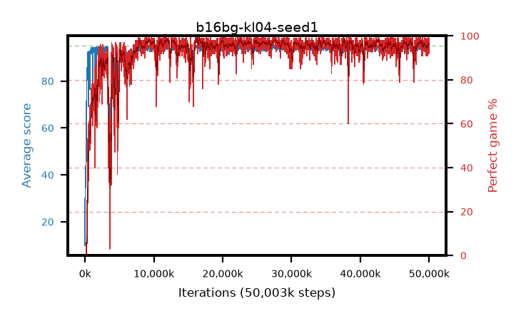

# b16bg-kl04-seed1

step **50,003,968** · 3052 evals · trailing **94.1** · peak **94.59** @16,564,224 · sef **93.1** · best30 **98.0** @16,629,760

## Config

| | |
|---|---|
| algo | ppo |
| collect_envs | 128 |
| discount | 0.99 |
| eval_interval | 16384 |
| eval_queue | True |
| eval_queue_depth | 16 |
| eval_workers | 8 |
| fc_layers | (320,) |
| graph_eval_episodes | 100 |
| max_steps | 50003968 |
| min_checkpoint_score | 40.0 |
| ppo_adam_epsilon | 1e-07 |
| ppo_anneal_fraction | 1.0 |
| ppo_clip | 0.2 |
| ppo_clip_final | None |
| ppo_entropy_coef | 0.01 |
| ppo_entropy_coef_final | None |
| ppo_epochs | 4 |
| ppo_gae_lambda | 0.98 |
| ppo_gradient_clipping | 0.5 |
| ppo_horizon | 33.6 |
| ppo_learning_rate | 0.0003 |
| ppo_learning_rate_final | None |
| ppo_minibatch | 256 |
| ppo_normalize_adv | True |
| ppo_rollout | 128 |
| ppo_target_kl | 0.04 |
| ppo_transitions_per_rollout | 16384 |
| ppo_value_loss | huber |
| ppo_vf_coef | 0.5 |
| seed | 1 |
| torch_threads | 1 |

## Evals

| step | avg score | trailing avg | min score | max score | avg reward | perfect % | epsilon |
|---|---|---|---|---|---|---|---|
| 16384 | 9.9 | 9.9 | 1.0 | 28.0 | 8.484 | 0.0 |  |
| 32768 | 43.64 | 30.85 | 9.0 | 81.0 | 38.498 | 0.0 |  |
| 49152 | 35.39 | 22.64 | 7.0 | 64.0 | 30.312 | 0.0 |  |
| ... | ... | ... | ... | ... | ... | ... | ... |
| 49823744 | 93.23 | 94.02 | 64.0 | 95.0 | 183.966 | 92.0 |  |
| 49840128 | 94.99 | 94.16 | 94.0 | 95.0 | 192.651 | 99.0 |  |
| 49856512 | 94.26 | 94.13 | 62.0 | 95.0 | 188.896 | 96.0 |  |
| 49872896 | 94.01 | 94.1 | 52.0 | 95.0 | 187.725 | 95.0 |  |
| 49889280 | 95.0 | 94.09 | 95.0 | 95.0 | 193.701 | 100.0 |  |
| 49905664 | 93.42 | 94.03 | 24.0 | 95.0 | 188.103 | 96.0 |  |
| 49922048 | 94.27 | 94.04 | 22.0 | 95.0 | 191.966 | 99.0 |  |
| 49938432 | 94.92 | 94.05 | 87.0 | 95.0 | 192.616 | 99.0 |  |
| 49954816 | 94.1 | 94.07 | 58.0 | 95.0 | 187.823 | 95.0 |  |
| 49971200 | 93.61 | 94.05 | 59.0 | 95.0 | 187.286 | 95.0 |  |
| 49987584 | 93.89 | 94.07 | 63.0 | 95.0 | 184.575 | 92.0 |  |
| 50003968 | 94.25 | 94.1 | 61.0 | 95.0 | 189.965 | 97.0 |  |
