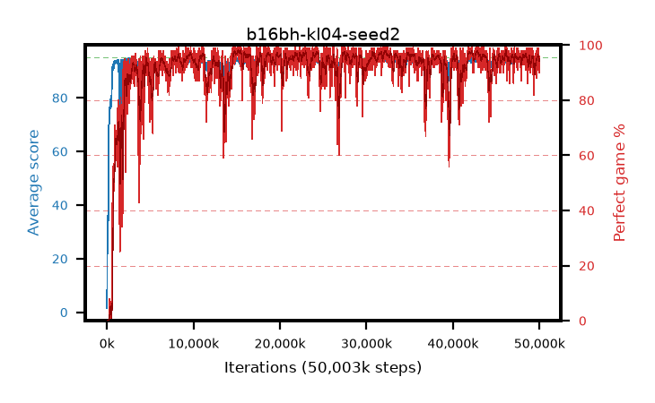

# b16bh-kl04-seed2

step **50,003,968** · 3052 evals · trailing **94.09** · peak **94.48** @42,762,240 · sef **92.6** · best30 **97.9** @15,450,112

## Config

| | |
|---|---|
| algo | ppo |
| collect_envs | 128 |
| discount | 0.99 |
| eval_interval | 16384 |
| eval_queue | True |
| eval_queue_depth | 16 |
| eval_workers | 8 |
| fc_layers | (320,) |
| graph_eval_episodes | 100 |
| max_steps | 50003968 |
| min_checkpoint_score | 40.0 |
| ppo_adam_epsilon | 1e-07 |
| ppo_anneal_fraction | 1.0 |
| ppo_clip | 0.2 |
| ppo_clip_final | None |
| ppo_entropy_coef | 0.01 |
| ppo_entropy_coef_final | None |
| ppo_epochs | 4 |
| ppo_gae_lambda | 0.98 |
| ppo_gradient_clipping | 0.5 |
| ppo_horizon | 33.6 |
| ppo_learning_rate | 0.0003 |
| ppo_learning_rate_final | None |
| ppo_minibatch | 256 |
| ppo_normalize_adv | True |
| ppo_rollout | 128 |
| ppo_target_kl | 0.04 |
| ppo_transitions_per_rollout | 16384 |
| ppo_value_loss | huber |
| ppo_vf_coef | 0.5 |
| seed | 2 |
| torch_threads | 1 |

## Evals

| step | avg score | trailing avg | min score | max score | avg reward | perfect % | epsilon |
|---|---|---|---|---|---|---|---|
| 16384 | 1.53 | 1.53 | 0.0 | 6.0 | -0.629 | 0.0 |  |
| 32768 | 16.73 | 17.37 | 7.0 | 29.0 | 12.073 | 0.0 |  |
| 49152 | 25.49 | 18.99 | 8.0 | 47.0 | 20.451 | 0.0 |  |
| ... | ... | ... | ... | ... | ... | ... | ... |
| 49823744 | 94.73 | 93.99 | 74.0 | 95.0 | 191.453 | 98.0 |  |
| 49840128 | 93.43 | 94.06 | 8.0 | 95.0 | 183.155 | 91.0 |  |
| 49856512 | 94.66 | 94.07 | 82.0 | 95.0 | 188.324 | 95.0 |  |
| 49872896 | 94.93 | 93.8 | 91.0 | 95.0 | 191.63 | 98.0 |  |
| 49889280 | 94.97 | 93.85 | 92.0 | 95.0 | 192.663 | 99.0 |  |
| 49905664 | 94.12 | 94.08 | 12.0 | 95.0 | 189.842 | 97.0 |  |
| 49922048 | 94.55 | 93.99 | 79.0 | 95.0 | 187.258 | 94.0 |  |
| 49938432 | 93.85 | 94.02 | 66.0 | 95.0 | 183.514 | 91.0 |  |
| 49954816 | 94.24 | 94.07 | 74.0 | 95.0 | 186.937 | 94.0 |  |
| 49971200 | 93.65 | 94.06 | 70.0 | 95.0 | 182.365 | 90.0 |  |
| 49987584 | 93.4 | 94.05 | 8.0 | 95.0 | 183.103 | 91.0 |  |
| 50003968 | 94.47 | 94.09 | 74.0 | 95.0 | 189.152 | 96.0 |  |
