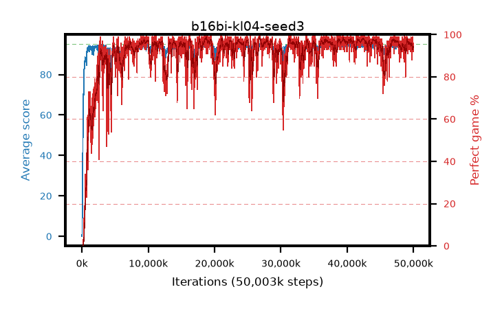

# b16bi-kl04-seed3

step **50,003,968** · 3052 evals · trailing **93.75** · peak **94.56** @42,319,872 · sef **91.2** · best30 **97.9** @18,825,216

## Config

| | |
|---|---|
| algo | ppo |
| collect_envs | 128 |
| discount | 0.99 |
| eval_interval | 16384 |
| eval_queue | True |
| eval_queue_depth | 16 |
| eval_workers | 8 |
| fc_layers | (320,) |
| graph_eval_episodes | 100 |
| max_steps | 50003968 |
| min_checkpoint_score | 40.0 |
| ppo_adam_epsilon | 1e-07 |
| ppo_anneal_fraction | 1.0 |
| ppo_clip | 0.2 |
| ppo_clip_final | None |
| ppo_entropy_coef | 0.01 |
| ppo_entropy_coef_final | None |
| ppo_epochs | 4 |
| ppo_gae_lambda | 0.98 |
| ppo_gradient_clipping | 0.5 |
| ppo_horizon | 33.6 |
| ppo_learning_rate | 0.0003 |
| ppo_learning_rate_final | None |
| ppo_minibatch | 256 |
| ppo_normalize_adv | True |
| ppo_rollout | 128 |
| ppo_target_kl | 0.04 |
| ppo_transitions_per_rollout | 16384 |
| ppo_value_loss | huber |
| ppo_vf_coef | 0.5 |
| seed | 3 |
| torch_threads | 1 |

## Evals

| step | avg score | trailing avg | min score | max score | avg reward | perfect % | epsilon |
|---|---|---|---|---|---|---|---|
| 16384 | 0.02 | 0.02 | 0.0 | 1.0 | -4.091 | 0.0 |  |
| 32768 | 1.66 | 0.84 | 0.0 | 10.0 | 0.965 | 0.0 |  |
| 49152 | 18.6 | 17.31 | 3.0 | 37.0 | 14.109 | 0.0 |  |
| ... | ... | ... | ... | ... | ... | ... | ... |
| 49823744 | 93.99 | 93.61 | 60.0 | 95.0 | 187.7 | 95.0 |  |
| 49840128 | 93.81 | 93.66 | 58.0 | 95.0 | 185.513 | 93.0 |  |
| 49856512 | 92.8 | 93.65 | 14.0 | 95.0 | 183.523 | 92.0 |  |
| 49872896 | 94.86 | 93.7 | 81.0 | 95.0 | 192.564 | 99.0 |  |
| 49889280 | 93.9 | 93.68 | 58.0 | 95.0 | 185.609 | 93.0 |  |
| 49905664 | 94.73 | 93.77 | 83.0 | 95.0 | 189.43 | 96.0 |  |
| 49922048 | 93.38 | 93.73 | 41.0 | 95.0 | 184.064 | 92.0 |  |
| 49938432 | 94.23 | 93.69 | 62.0 | 95.0 | 188.948 | 96.0 |  |
| 49954816 | 94.11 | 93.67 | 74.0 | 95.0 | 185.819 | 93.0 |  |
| 49971200 | 94.41 | 93.67 | 66.0 | 95.0 | 188.12 | 95.0 |  |
| 49987584 | 94.07 | 93.73 | 78.0 | 95.0 | 184.768 | 92.0 |  |
| 50003968 | 94.4 | 93.75 | 67.0 | 95.0 | 188.087 | 95.0 |  |
