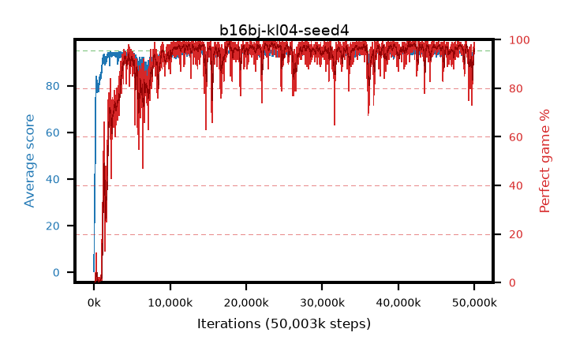

# b16bj-kl04-seed4

step **50,003,968** · 3052 evals · trailing **93.2** · peak **94.65** @41,189,376 · sef **90.3** · best30 **98.2** @23,412,736

## Config

| | |
|---|---|
| algo | ppo |
| collect_envs | 128 |
| discount | 0.99 |
| eval_interval | 16384 |
| eval_queue | True |
| eval_queue_depth | 16 |
| eval_workers | 8 |
| fc_layers | (320,) |
| graph_eval_episodes | 100 |
| max_steps | 50003968 |
| min_checkpoint_score | 40.0 |
| ppo_adam_epsilon | 1e-07 |
| ppo_anneal_fraction | 1.0 |
| ppo_clip | 0.2 |
| ppo_clip_final | None |
| ppo_entropy_coef | 0.01 |
| ppo_entropy_coef_final | None |
| ppo_epochs | 4 |
| ppo_gae_lambda | 0.98 |
| ppo_gradient_clipping | 0.5 |
| ppo_horizon | 33.6 |
| ppo_learning_rate | 0.0003 |
| ppo_learning_rate_final | None |
| ppo_minibatch | 256 |
| ppo_normalize_adv | True |
| ppo_rollout | 128 |
| ppo_target_kl | 0.04 |
| ppo_transitions_per_rollout | 16384 |
| ppo_value_loss | huber |
| ppo_vf_coef | 0.5 |
| seed | 4 |
| torch_threads | 1 |

## Evals

| step | avg score | trailing avg | min score | max score | avg reward | perfect % | epsilon |
|---|---|---|---|---|---|---|---|
| 16384 | 0.36 | 0.36 | 0.0 | 4.0 | -0.591 | 0.0 |  |
| 32768 | 19.01 | 14.87 | 1.0 | 38.0 | 14.568 | 0.0 |  |
| 49152 | 25.24 | 12.8 | 5.0 | 44.0 | 20.211 | 0.0 |  |
| ... | ... | ... | ... | ... | ... | ... | ... |
| 49823744 | 94.22 | 93.24 | 69.0 | 95.0 | 188.919 | 96.0 |  |
| 49840128 | 94.08 | 92.92 | 61.0 | 95.0 | 186.794 | 94.0 |  |
| 49856512 | 94.1 | 92.91 | 56.0 | 95.0 | 189.807 | 97.0 |  |
| 49872896 | 94.61 | 93.15 | 78.0 | 95.0 | 190.33 | 97.0 |  |
| 49889280 | 93.18 | 93.07 | 12.0 | 95.0 | 183.908 | 92.0 |  |
| 49905664 | 94.32 | 92.96 | 66.0 | 95.0 | 190.029 | 97.0 |  |
| 49922048 | 94.32 | 93.2 | 79.0 | 95.0 | 187.02 | 94.0 |  |
| 49938432 | 93.5 | 92.92 | 22.0 | 95.0 | 187.192 | 95.0 |  |
| 49954816 | 94.6 | 93.05 | 61.0 | 95.0 | 191.329 | 98.0 |  |
| 49971200 | 94.93 | 93.26 | 88.0 | 95.0 | 192.632 | 99.0 |  |
| 49987584 | 94.56 | 93.0 | 76.0 | 95.0 | 189.262 | 96.0 |  |
| 50003968 | 94.23 | 93.2 | 56.0 | 95.0 | 189.926 | 97.0 |  |
