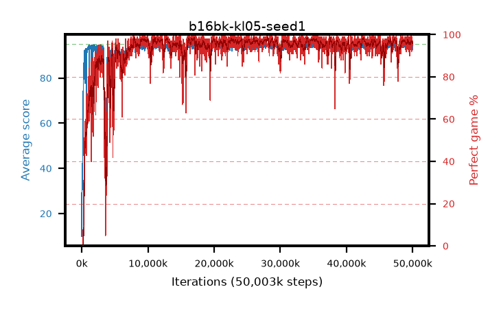

# b16bk-kl05-seed1

step **50,003,968** · 3052 evals · trailing **94.27** · peak **94.58** @35,061,760 · sef **93.7** · best30 **97.9** @16,957,440

## Config

| | |
|---|---|
| algo | ppo |
| collect_envs | 128 |
| discount | 0.99 |
| eval_interval | 16384 |
| eval_queue | True |
| eval_queue_depth | 16 |
| eval_workers | 8 |
| fc_layers | (320,) |
| graph_eval_episodes | 100 |
| max_steps | 50003968 |
| min_checkpoint_score | 40.0 |
| ppo_adam_epsilon | 1e-07 |
| ppo_anneal_fraction | 1.0 |
| ppo_clip | 0.2 |
| ppo_clip_final | None |
| ppo_entropy_coef | 0.01 |
| ppo_entropy_coef_final | None |
| ppo_epochs | 4 |
| ppo_gae_lambda | 0.98 |
| ppo_gradient_clipping | 0.5 |
| ppo_horizon | 33.6 |
| ppo_learning_rate | 0.0003 |
| ppo_learning_rate_final | None |
| ppo_minibatch | 256 |
| ppo_normalize_adv | True |
| ppo_rollout | 128 |
| ppo_target_kl | 0.05 |
| ppo_transitions_per_rollout | 16384 |
| ppo_value_loss | huber |
| ppo_vf_coef | 0.5 |
| seed | 1 |
| torch_threads | 1 |

## Evals

| step | avg score | trailing avg | min score | max score | avg reward | perfect % | epsilon |
|---|---|---|---|---|---|---|---|
| 16384 | 9.91 | 21.31 | 0.0 | 28.0 | 8.629 | 0.0 |  |
| 32768 | 42.16 | 32.29 | 11.0 | 89.0 | 37.221 | 0.0 |  |
| 49152 | 36.4 | 27.39 | 12.0 | 69.0 | 31.358 | 0.0 |  |
| ... | ... | ... | ... | ... | ... | ... | ... |
| 49823744 | 93.04 | 94.23 | 28.0 | 95.0 | 183.758 | 92.0 |  |
| 49840128 | 94.52 | 94.23 | 66.0 | 95.0 | 191.229 | 98.0 |  |
| 49856512 | 94.93 | 94.29 | 88.0 | 95.0 | 192.633 | 99.0 |  |
| 49872896 | 94.29 | 94.31 | 59.0 | 95.0 | 189.006 | 96.0 |  |
| 49889280 | 93.89 | 94.3 | 20.0 | 95.0 | 189.605 | 97.0 |  |
| 49905664 | 93.55 | 94.25 | 16.0 | 95.0 | 188.265 | 96.0 |  |
| 49922048 | 94.02 | 94.3 | 59.0 | 95.0 | 186.733 | 94.0 |  |
| 49938432 | 94.82 | 94.31 | 87.0 | 95.0 | 190.531 | 97.0 |  |
| 49954816 | 92.76 | 94.25 | 14.0 | 95.0 | 186.452 | 95.0 |  |
| 49971200 | 93.54 | 94.29 | 8.0 | 95.0 | 187.258 | 95.0 |  |
| 49987584 | 94.38 | 94.28 | 66.0 | 95.0 | 189.082 | 96.0 |  |
| 50003968 | 94.28 | 94.27 | 63.0 | 95.0 | 187.989 | 95.0 |  |
