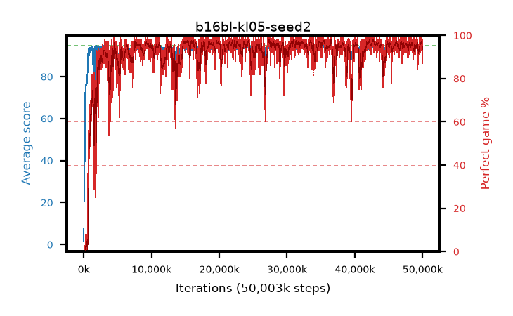

# b16bl-kl05-seed2

step **50,003,968** · 3052 evals · trailing **93.88** · peak **94.52** @42,680,320 · sef **92.7** · best30 **97.1** @15,286,272

## Config

| | |
|---|---|
| algo | ppo |
| collect_envs | 128 |
| discount | 0.99 |
| eval_interval | 16384 |
| eval_queue | True |
| eval_queue_depth | 16 |
| eval_workers | 8 |
| fc_layers | (320,) |
| graph_eval_episodes | 100 |
| max_steps | 50003968 |
| min_checkpoint_score | 40.0 |
| ppo_adam_epsilon | 1e-07 |
| ppo_anneal_fraction | 1.0 |
| ppo_clip | 0.2 |
| ppo_clip_final | None |
| ppo_entropy_coef | 0.01 |
| ppo_entropy_coef_final | None |
| ppo_epochs | 4 |
| ppo_gae_lambda | 0.98 |
| ppo_gradient_clipping | 0.5 |
| ppo_horizon | 33.6 |
| ppo_learning_rate | 0.0003 |
| ppo_learning_rate_final | None |
| ppo_minibatch | 256 |
| ppo_normalize_adv | True |
| ppo_rollout | 128 |
| ppo_target_kl | 0.05 |
| ppo_transitions_per_rollout | 16384 |
| ppo_value_loss | huber |
| ppo_vf_coef | 0.5 |
| seed | 2 |
| torch_threads | 1 |

## Evals

| step | avg score | trailing avg | min score | max score | avg reward | perfect % | epsilon |
|---|---|---|---|---|---|---|---|
| 16384 | 1.38 | 1.38 | 0.0 | 4.0 | -0.689 | 0.0 |  |
| 32768 | 16.38 | 14.05 | 5.0 | 34.0 | 11.761 | 0.0 |  |
| 49152 | 24.4 | 12.89 | 6.0 | 47.0 | 19.41 | 0.0 |  |
| ... | ... | ... | ... | ... | ... | ... | ... |
| 49823744 | 94.87 | 93.89 | 86.0 | 95.0 | 191.578 | 98.0 |  |
| 49840128 | 93.96 | 93.88 | 4.0 | 95.0 | 189.674 | 97.0 |  |
| 49856512 | 93.65 | 93.88 | 26.0 | 95.0 | 185.31 | 93.0 |  |
| 49872896 | 94.43 | 93.9 | 65.0 | 95.0 | 191.128 | 98.0 |  |
| 49889280 | 94.21 | 93.91 | 52.0 | 95.0 | 188.86 | 96.0 |  |
| 49905664 | 94.11 | 93.89 | 6.0 | 95.0 | 191.818 | 99.0 |  |
| 49922048 | 93.54 | 93.86 | 4.0 | 95.0 | 186.244 | 94.0 |  |
| 49938432 | 92.72 | 93.81 | 20.0 | 95.0 | 178.358 | 87.0 |  |
| 49954816 | 93.5 | 93.88 | 68.0 | 95.0 | 181.142 | 89.0 |  |
| 49971200 | 93.23 | 93.79 | 71.0 | 95.0 | 179.938 | 88.0 |  |
| 49987584 | 94.33 | 93.82 | 76.0 | 95.0 | 188.021 | 95.0 |  |
| 50003968 | 94.78 | 93.88 | 81.0 | 95.0 | 191.467 | 98.0 |  |
