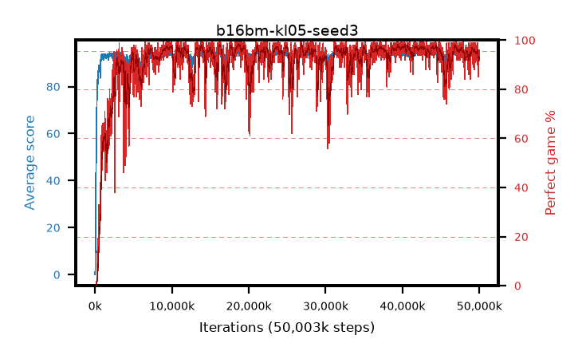

# b16bm-kl05-seed3

step **50,003,968** · 3052 evals · trailing **93.77** · peak **94.6** @39,763,968 · sef **91.0** · best30 **97.9** @18,841,600

## Config

| | |
|---|---|
| algo | ppo |
| collect_envs | 128 |
| discount | 0.99 |
| eval_interval | 16384 |
| eval_queue | True |
| eval_queue_depth | 16 |
| eval_workers | 8 |
| fc_layers | (320,) |
| graph_eval_episodes | 100 |
| max_steps | 50003968 |
| min_checkpoint_score | 40.0 |
| ppo_adam_epsilon | 1e-07 |
| ppo_anneal_fraction | 1.0 |
| ppo_clip | 0.2 |
| ppo_clip_final | None |
| ppo_entropy_coef | 0.01 |
| ppo_entropy_coef_final | None |
| ppo_epochs | 4 |
| ppo_gae_lambda | 0.98 |
| ppo_gradient_clipping | 0.5 |
| ppo_horizon | 33.6 |
| ppo_learning_rate | 0.0003 |
| ppo_learning_rate_final | None |
| ppo_minibatch | 256 |
| ppo_normalize_adv | True |
| ppo_rollout | 128 |
| ppo_target_kl | 0.05 |
| ppo_transitions_per_rollout | 16384 |
| ppo_value_loss | huber |
| ppo_vf_coef | 0.5 |
| seed | 3 |
| torch_threads | 1 |

## Evals

| step | avg score | trailing avg | min score | max score | avg reward | perfect % | epsilon |
|---|---|---|---|---|---|---|---|
| 16384 | 0.03 | 0.03 | 0.0 | 1.0 | -4.304 | 0.0 |  |
| 32768 | 2.0 | 1.01 | 0.0 | 9.0 | 1.3 | 0.0 |  |
| 49152 | 17.52 | 11.08 | 1.0 | 37.0 | 13.036 | 0.0 |  |
| ... | ... | ... | ... | ... | ... | ... | ... |
| 49823744 | 94.21 | 93.7 | 68.0 | 95.0 | 187.921 | 95.0 |  |
| 49840128 | 92.97 | 93.64 | 72.0 | 95.0 | 176.687 | 85.0 |  |
| 49856512 | 93.1 | 93.64 | 40.0 | 95.0 | 182.771 | 91.0 |  |
| 49872896 | 94.06 | 93.75 | 73.0 | 95.0 | 184.763 | 92.0 |  |
| 49889280 | 93.86 | 93.67 | 68.0 | 95.0 | 186.563 | 94.0 |  |
| 49905664 | 94.22 | 93.69 | 67.0 | 95.0 | 185.933 | 93.0 |  |
| 49922048 | 93.42 | 93.73 | 72.0 | 95.0 | 182.131 | 90.0 |  |
| 49938432 | 94.45 | 93.78 | 71.0 | 95.0 | 189.162 | 96.0 |  |
| 49954816 | 93.85 | 93.77 | 58.0 | 95.0 | 187.561 | 95.0 |  |
| 49971200 | 94.27 | 93.78 | 57.0 | 95.0 | 187.962 | 95.0 |  |
| 49987584 | 94.0 | 93.77 | 65.0 | 95.0 | 185.71 | 93.0 |  |
| 50003968 | 94.23 | 93.77 | 66.0 | 95.0 | 185.932 | 93.0 |  |
