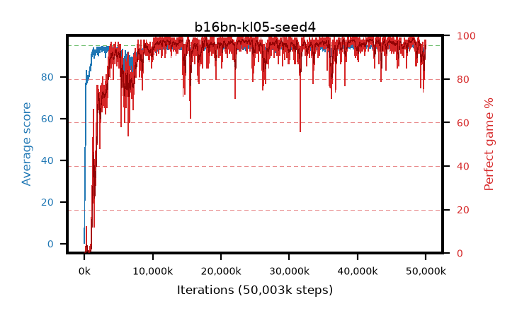

# b16bn-kl05-seed4

step **50,003,968** · 3052 evals · trailing **93.16** · peak **94.67** @48,283,648 · sef **90.0** · best30 **98.1** @42,139,648

## Config

| | |
|---|---|
| algo | ppo |
| collect_envs | 128 |
| discount | 0.99 |
| eval_interval | 16384 |
| eval_queue | True |
| eval_queue_depth | 16 |
| eval_workers | 8 |
| fc_layers | (320,) |
| graph_eval_episodes | 100 |
| max_steps | 50003968 |
| min_checkpoint_score | 40.0 |
| ppo_adam_epsilon | 1e-07 |
| ppo_anneal_fraction | 1.0 |
| ppo_clip | 0.2 |
| ppo_clip_final | None |
| ppo_entropy_coef | 0.01 |
| ppo_entropy_coef_final | None |
| ppo_epochs | 4 |
| ppo_gae_lambda | 0.98 |
| ppo_gradient_clipping | 0.5 |
| ppo_horizon | 33.6 |
| ppo_learning_rate | 0.0003 |
| ppo_learning_rate_final | None |
| ppo_minibatch | 256 |
| ppo_normalize_adv | True |
| ppo_rollout | 128 |
| ppo_target_kl | 0.05 |
| ppo_transitions_per_rollout | 16384 |
| ppo_value_loss | huber |
| ppo_vf_coef | 0.5 |
| seed | 4 |
| torch_threads | 1 |

## Evals

| step | avg score | trailing avg | min score | max score | avg reward | perfect % | epsilon |
|---|---|---|---|---|---|---|---|
| 16384 | 0.25 | 0.25 | 0.0 | 4.0 | -0.701 | 0.0 |  |
| 32768 | 18.63 | 9.44 | 1.0 | 37.0 | 14.314 | 0.0 |  |
| 49152 | 24.92 | 14.6 | 7.0 | 48.0 | 19.89 | 0.0 |  |
| ... | ... | ... | ... | ... | ... | ... | ... |
| 49823744 | 94.57 | 93.14 | 78.0 | 95.0 | 187.229 | 94.0 |  |
| 49840128 | 92.39 | 93.05 | 12.0 | 95.0 | 180.122 | 89.0 |  |
| 49856512 | 93.3 | 93.09 | 14.0 | 95.0 | 188.012 | 96.0 |  |
| 49872896 | 94.48 | 93.13 | 62.0 | 95.0 | 189.198 | 96.0 |  |
| 49889280 | 93.83 | 93.09 | 14.0 | 95.0 | 188.551 | 96.0 |  |
| 49905664 | 94.75 | 93.12 | 81.0 | 95.0 | 191.472 | 98.0 |  |
| 49922048 | 94.4 | 93.2 | 65.0 | 95.0 | 190.131 | 97.0 |  |
| 49938432 | 94.01 | 93.17 | 10.0 | 95.0 | 190.745 | 98.0 |  |
| 49954816 | 94.16 | 93.21 | 64.0 | 95.0 | 187.883 | 95.0 |  |
| 49971200 | 93.4 | 93.17 | 3.0 | 95.0 | 186.125 | 94.0 |  |
| 49987584 | 94.38 | 93.16 | 69.0 | 95.0 | 188.079 | 95.0 |  |
| 50003968 | 93.75 | 93.16 | 30.0 | 95.0 | 188.441 | 96.0 |  |
