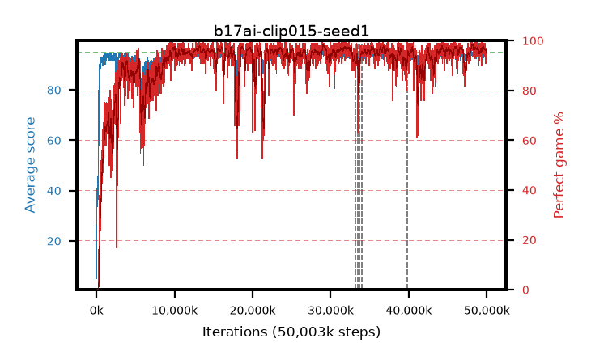

# b17ai-clip015-seed1

step **50,003,968** · 3052 evals · trailing **94.23** · peak **94.45** @46,071,808 · sef **90.1** · best30 **97.6** @29,343,744

## Config

| | |
|---|---|
| algo | ppo |
| collect_envs | 128 |
| discount | 0.99 |
| eval_interval | 16384 |
| eval_queue | True |
| eval_queue_depth | 16 |
| eval_workers | 8 |
| fc_layers | (320,) |
| graph_eval_episodes | 100 |
| max_steps | 50003968 |
| min_checkpoint_score | 40.0 |
| ppo_adam_epsilon | 1e-07 |
| ppo_anneal_fraction | 1.0 |
| ppo_clip | 0.15 |
| ppo_clip_final | None |
| ppo_entropy_coef | 0.01 |
| ppo_entropy_coef_final | None |
| ppo_epochs | 4 |
| ppo_gae_lambda | 0.98 |
| ppo_gradient_clipping | 0.5 |
| ppo_horizon | 33.6 |
| ppo_learning_rate | 0.0003 |
| ppo_learning_rate_final | None |
| ppo_minibatch | 256 |
| ppo_normalize_adv | True |
| ppo_rollout | 128 |
| ppo_target_kl | 0.0 |
| ppo_transitions_per_rollout | 16384 |
| ppo_value_loss | huber |
| ppo_vf_coef | 0.5 |
| seed | 1 |
| torch_threads | 1 |

## Resumes

Resumed at 33,177,600, 33,456,128, 33,718,272, 33,980,416, 39,796,736

## Evals

| step | avg score | trailing avg | min score | max score | avg reward | perfect % | epsilon |
|---|---|---|---|---|---|---|---|
| 16384 | 5.18 | 5.18 | 0.0 | 20.0 | 0.276 | 0.0 |  |
| 32768 | 40.54 | 30.55 | 12.0 | 70.0 | 35.415 | 0.0 |  |
| 49152 | 34.21 | 24.35 | 14.0 | 55.0 | 29.144 | 0.0 |  |
| ... | ... | ... | ... | ... | ... | ... | ... |
| 49823744 | 93.74 | 94.27 | 20.0 | 95.0 | 187.466 | 95.0 |  |
| 49840128 | 93.58 | 94.21 | 1.0 | 95.0 | 188.317 | 96.0 |  |
| 49856512 | 92.82 | 94.23 | 5.0 | 95.0 | 185.572 | 94.0 |  |
| 49872896 | 94.29 | 94.28 | 73.0 | 95.0 | 188.022 | 95.0 |  |
| 49889280 | 93.35 | 94.2 | 24.0 | 95.0 | 183.098 | 91.0 |  |
| 49905664 | 93.33 | 94.19 | 60.0 | 95.0 | 186.06 | 94.0 |  |
| 49922048 | 94.47 | 94.23 | 64.0 | 95.0 | 190.192 | 97.0 |  |
| 49938432 | 94.13 | 94.19 | 57.0 | 95.0 | 188.865 | 96.0 |  |
| 49954816 | 93.57 | 94.13 | 1.0 | 95.0 | 188.297 | 96.0 |  |
| 49971200 | 94.67 | 94.18 | 82.0 | 95.0 | 190.392 | 97.0 |  |
| 49987584 | 94.54 | 94.22 | 56.0 | 95.0 | 190.257 | 97.0 |  |
| 50003968 | 94.79 | 94.23 | 82.0 | 95.0 | 190.517 | 97.0 |  |
