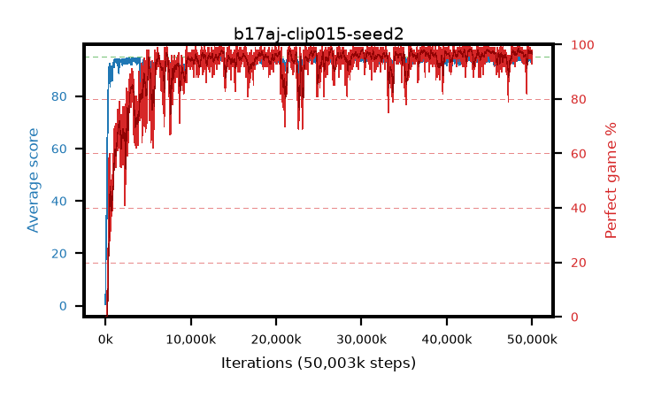

# b17aj-clip015-seed2

step **50,003,968** · 3052 evals · trailing **94.22** · peak **94.54** @48,627,712 · sef **91.3** · best30 **97.9** @42,860,544

## Config

| | |
|---|---|
| algo | ppo |
| collect_envs | 128 |
| discount | 0.99 |
| eval_interval | 16384 |
| eval_queue | True |
| eval_queue_depth | 16 |
| eval_workers | 8 |
| fc_layers | (320,) |
| graph_eval_episodes | 100 |
| max_steps | 50003968 |
| min_checkpoint_score | 40.0 |
| ppo_adam_epsilon | 1e-07 |
| ppo_anneal_fraction | 1.0 |
| ppo_clip | 0.15 |
| ppo_clip_final | None |
| ppo_entropy_coef | 0.01 |
| ppo_entropy_coef_final | None |
| ppo_epochs | 4 |
| ppo_gae_lambda | 0.98 |
| ppo_gradient_clipping | 0.5 |
| ppo_horizon | 33.6 |
| ppo_learning_rate | 0.0003 |
| ppo_learning_rate_final | None |
| ppo_minibatch | 256 |
| ppo_normalize_adv | True |
| ppo_rollout | 128 |
| ppo_target_kl | 0.0 |
| ppo_transitions_per_rollout | 16384 |
| ppo_value_loss | huber |
| ppo_vf_coef | 0.5 |
| seed | 2 |
| torch_threads | 1 |

## Evals

| step | avg score | trailing avg | min score | max score | avg reward | perfect % | epsilon |
|---|---|---|---|---|---|---|---|
| 16384 | 0.49 | 0.49 | 0.0 | 4.0 | -0.284 | 0.0 |  |
| 32768 | 7.21 | 3.85 | 0.0 | 19.0 | 2.912 | 0.0 |  |
| 49152 | 22.74 | 18.97 | 4.0 | 51.0 | 17.791 | 0.0 |  |
| ... | ... | ... | ... | ... | ... | ... | ... |
| 49823744 | 94.5 | 94.21 | 71.0 | 95.0 | 190.219 | 97.0 |  |
| 49840128 | 94.54 | 94.19 | 64.0 | 95.0 | 191.248 | 98.0 |  |
| 49856512 | 94.63 | 94.23 | 61.0 | 95.0 | 191.351 | 98.0 |  |
| 49872896 | 92.97 | 94.22 | 8.0 | 95.0 | 186.692 | 95.0 |  |
| 49889280 | 94.7 | 94.35 | 68.0 | 95.0 | 191.418 | 98.0 |  |
| 49905664 | 94.45 | 94.27 | 62.0 | 95.0 | 189.166 | 96.0 |  |
| 49922048 | 94.04 | 94.25 | 10.0 | 95.0 | 190.748 | 98.0 |  |
| 49938432 | 94.07 | 94.26 | 58.0 | 95.0 | 188.803 | 96.0 |  |
| 49954816 | 94.47 | 94.27 | 56.0 | 95.0 | 191.178 | 98.0 |  |
| 49971200 | 93.49 | 94.31 | 59.0 | 95.0 | 185.222 | 93.0 |  |
| 49987584 | 93.84 | 94.29 | 51.0 | 95.0 | 187.534 | 95.0 |  |
| 50003968 | 93.91 | 94.22 | 53.0 | 95.0 | 189.638 | 97.0 |  |
