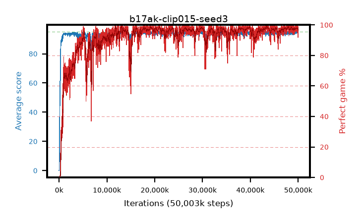

# b17ak-clip015-seed3

step **50,003,968** · 3052 evals · trailing **94.45** · peak **94.61** @29,687,808 · sef **90.4** · best30 **98.4** @43,466,752

## Config

| | |
|---|---|
| algo | ppo |
| collect_envs | 128 |
| discount | 0.99 |
| eval_interval | 16384 |
| eval_queue | True |
| eval_queue_depth | 16 |
| eval_workers | 8 |
| fc_layers | (320,) |
| graph_eval_episodes | 100 |
| max_steps | 50003968 |
| min_checkpoint_score | 40.0 |
| ppo_adam_epsilon | 1e-07 |
| ppo_anneal_fraction | 1.0 |
| ppo_clip | 0.15 |
| ppo_clip_final | None |
| ppo_entropy_coef | 0.01 |
| ppo_entropy_coef_final | None |
| ppo_epochs | 4 |
| ppo_gae_lambda | 0.98 |
| ppo_gradient_clipping | 0.5 |
| ppo_horizon | 33.6 |
| ppo_learning_rate | 0.0003 |
| ppo_learning_rate_final | None |
| ppo_minibatch | 256 |
| ppo_normalize_adv | True |
| ppo_rollout | 128 |
| ppo_target_kl | 0.0 |
| ppo_transitions_per_rollout | 16384 |
| ppo_value_loss | huber |
| ppo_vf_coef | 0.5 |
| seed | 3 |
| torch_threads | 1 |

## Evals

| step | avg score | trailing avg | min score | max score | avg reward | perfect % | epsilon |
|---|---|---|---|---|---|---|---|
| 16384 | 0.02 | 0.02 | 0.0 | 1.0 | -4.985 | 0.0 |  |
| 32768 | 0.17 | 0.1 | 0.0 | 2.0 | -0.38 | 0.0 |  |
| 49152 | 9.31 | 15.28 | 0.0 | 36.0 | 7.497 | 0.0 |  |
| ... | ... | ... | ... | ... | ... | ... | ... |
| 49823744 | 94.51 | 94.51 | 80.0 | 95.0 | 188.212 | 95.0 |  |
| 49840128 | 94.79 | 94.52 | 74.0 | 95.0 | 192.487 | 99.0 |  |
| 49856512 | 94.92 | 94.49 | 90.0 | 95.0 | 191.613 | 98.0 |  |
| 49872896 | 94.9 | 94.53 | 91.0 | 95.0 | 190.601 | 97.0 |  |
| 49889280 | 95.0 | 94.52 | 95.0 | 95.0 | 193.673 | 100.0 |  |
| 49905664 | 94.7 | 94.51 | 65.0 | 95.0 | 192.39 | 99.0 |  |
| 49922048 | 94.6 | 94.48 | 78.0 | 95.0 | 189.297 | 96.0 |  |
| 49938432 | 94.95 | 94.54 | 90.0 | 95.0 | 192.655 | 99.0 |  |
| 49954816 | 92.13 | 94.47 | 1.0 | 95.0 | 182.83 | 92.0 |  |
| 49971200 | 93.94 | 94.5 | 32.0 | 95.0 | 187.59 | 95.0 |  |
| 49987584 | 93.54 | 94.51 | 36.0 | 95.0 | 187.23 | 95.0 |  |
| 50003968 | 93.51 | 94.45 | 34.0 | 95.0 | 184.212 | 92.0 |  |
