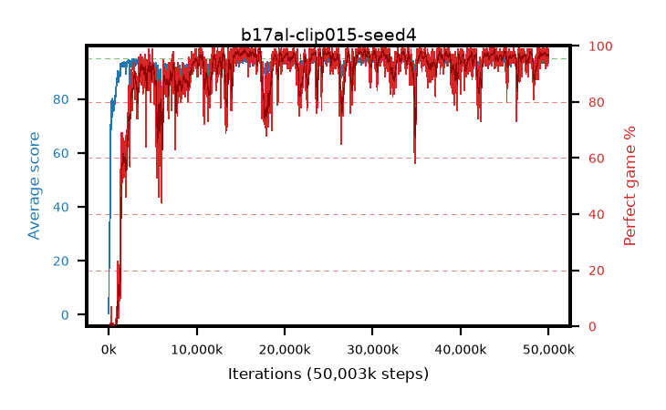

# b17al-clip015-seed4

step **50,003,968** · 3052 evals · trailing **94.29** · peak **94.57** @15,564,800 · sef **90.1** · best30 **98.1** @15,581,184

## Config

| | |
|---|---|
| algo | ppo |
| collect_envs | 128 |
| discount | 0.99 |
| eval_interval | 16384 |
| eval_queue | True |
| eval_queue_depth | 16 |
| eval_workers | 8 |
| fc_layers | (320,) |
| graph_eval_episodes | 100 |
| max_steps | 50003968 |
| min_checkpoint_score | 40.0 |
| ppo_adam_epsilon | 1e-07 |
| ppo_anneal_fraction | 1.0 |
| ppo_clip | 0.15 |
| ppo_clip_final | None |
| ppo_entropy_coef | 0.01 |
| ppo_entropy_coef_final | None |
| ppo_epochs | 4 |
| ppo_gae_lambda | 0.98 |
| ppo_gradient_clipping | 0.5 |
| ppo_horizon | 33.6 |
| ppo_learning_rate | 0.0003 |
| ppo_learning_rate_final | None |
| ppo_minibatch | 256 |
| ppo_normalize_adv | True |
| ppo_rollout | 128 |
| ppo_target_kl | 0.0 |
| ppo_transitions_per_rollout | 16384 |
| ppo_value_loss | huber |
| ppo_vf_coef | 0.5 |
| seed | 4 |
| torch_threads | 1 |

## Evals

| step | avg score | trailing avg | min score | max score | avg reward | perfect % | epsilon |
|---|---|---|---|---|---|---|---|
| 16384 | 0.43 | 0.43 | 0.0 | 2.0 | -1.422 | 0.0 |  |
| 32768 | 11.77 | 17.61 | 0.0 | 27.0 | 7.977 | 0.0 |  |
| 49152 | 29.53 | 20.0 | 2.0 | 48.0 | 24.504 | 0.0 |  |
| ... | ... | ... | ... | ... | ... | ... | ... |
| 49823744 | 93.17 | 94.42 | 20.0 | 95.0 | 185.898 | 94.0 |  |
| 49840128 | 92.83 | 94.34 | 6.0 | 95.0 | 185.55 | 94.0 |  |
| 49856512 | 93.48 | 94.4 | 18.0 | 95.0 | 190.198 | 98.0 |  |
| 49872896 | 94.9 | 94.29 | 89.0 | 95.0 | 191.61 | 98.0 |  |
| 49889280 | 93.44 | 94.24 | 8.0 | 95.0 | 185.16 | 93.0 |  |
| 49905664 | 95.0 | 94.26 | 95.0 | 95.0 | 193.701 | 100.0 |  |
| 49922048 | 93.03 | 94.3 | 8.0 | 95.0 | 185.751 | 94.0 |  |
| 49938432 | 93.63 | 94.36 | 8.0 | 95.0 | 189.353 | 97.0 |  |
| 49954816 | 94.05 | 94.29 | 61.0 | 95.0 | 189.76 | 97.0 |  |
| 49971200 | 94.83 | 94.3 | 78.0 | 95.0 | 192.549 | 99.0 |  |
| 49987584 | 94.68 | 94.28 | 82.0 | 95.0 | 190.377 | 97.0 |  |
| 50003968 | 94.19 | 94.29 | 57.0 | 95.0 | 189.913 | 97.0 |  |
