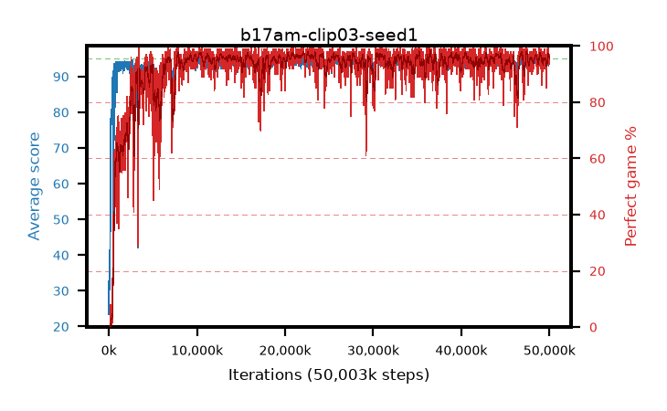

# b17am-clip03-seed1

step **50,003,968** · 3052 evals · trailing **93.89** · peak **94.41** @35,258,368 · sef **92.4** · best30 **97.0** @10,584,064

## Config

| | |
|---|---|
| algo | ppo |
| collect_envs | 128 |
| discount | 0.99 |
| eval_interval | 16384 |
| eval_queue | True |
| eval_queue_depth | 16 |
| eval_workers | 8 |
| fc_layers | (320,) |
| graph_eval_episodes | 100 |
| max_steps | 50003968 |
| min_checkpoint_score | 40.0 |
| ppo_adam_epsilon | 1e-07 |
| ppo_anneal_fraction | 1.0 |
| ppo_clip | 0.3 |
| ppo_clip_final | None |
| ppo_entropy_coef | 0.01 |
| ppo_entropy_coef_final | None |
| ppo_epochs | 4 |
| ppo_gae_lambda | 0.98 |
| ppo_gradient_clipping | 0.5 |
| ppo_horizon | 33.6 |
| ppo_learning_rate | 0.0003 |
| ppo_learning_rate_final | None |
| ppo_minibatch | 256 |
| ppo_normalize_adv | True |
| ppo_rollout | 128 |
| ppo_target_kl | 0.0 |
| ppo_transitions_per_rollout | 16384 |
| ppo_value_loss | huber |
| ppo_vf_coef | 0.5 |
| seed | 1 |
| torch_threads | 1 |

## Evals

| step | avg score | trailing avg | min score | max score | avg reward | perfect % | epsilon |
|---|---|---|---|---|---|---|---|
| 16384 | 23.42 | 23.42 | 0.0 | 42.0 | 18.483 | 0.0 |  |
| 32768 | 39.11 | 30.92 | 1.0 | 74.0 | 34.063 | 0.0 |  |
| 49152 | 30.24 | 26.83 | 1.0 | 56.0 | 25.24 | 0.0 |  |
| ... | ... | ... | ... | ... | ... | ... | ... |
| 49823744 | 95.0 | 93.87 | 95.0 | 95.0 | 193.695 | 100.0 |  |
| 49840128 | 93.8 | 93.83 | 24.0 | 95.0 | 189.476 | 97.0 |  |
| 49856512 | 93.33 | 93.84 | 23.0 | 95.0 | 185.959 | 94.0 |  |
| 49872896 | 95.0 | 93.74 | 95.0 | 95.0 | 193.696 | 100.0 |  |
| 49889280 | 94.17 | 93.9 | 51.0 | 95.0 | 187.84 | 95.0 |  |
| 49905664 | 94.59 | 93.88 | 60.0 | 95.0 | 190.299 | 97.0 |  |
| 49922048 | 94.14 | 93.89 | 57.0 | 95.0 | 185.727 | 93.0 |  |
| 49938432 | 94.85 | 93.89 | 88.0 | 95.0 | 190.558 | 97.0 |  |
| 49954816 | 94.57 | 93.91 | 81.0 | 95.0 | 189.276 | 96.0 |  |
| 49971200 | 94.31 | 93.95 | 54.0 | 95.0 | 188.026 | 95.0 |  |
| 49987584 | 94.25 | 93.88 | 76.0 | 95.0 | 186.971 | 94.0 |  |
| 50003968 | 93.6 | 93.89 | 10.0 | 95.0 | 187.317 | 95.0 |  |
