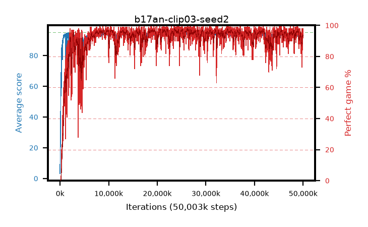

# b17an-clip03-seed2

step **50,003,968** · 3052 evals · trailing **93.6** · peak **94.41** @27,803,648 · sef **93.3** · best30 **97.3** @23,838,720

## Config

| | |
|---|---|
| algo | ppo |
| collect_envs | 128 |
| discount | 0.99 |
| eval_interval | 16384 |
| eval_queue | True |
| eval_queue_depth | 16 |
| eval_workers | 8 |
| fc_layers | (320,) |
| graph_eval_episodes | 100 |
| max_steps | 50003968 |
| min_checkpoint_score | 40.0 |
| ppo_adam_epsilon | 1e-07 |
| ppo_anneal_fraction | 1.0 |
| ppo_clip | 0.3 |
| ppo_clip_final | None |
| ppo_entropy_coef | 0.01 |
| ppo_entropy_coef_final | None |
| ppo_epochs | 4 |
| ppo_gae_lambda | 0.98 |
| ppo_gradient_clipping | 0.5 |
| ppo_horizon | 33.6 |
| ppo_learning_rate | 0.0003 |
| ppo_learning_rate_final | None |
| ppo_minibatch | 256 |
| ppo_normalize_adv | True |
| ppo_rollout | 128 |
| ppo_target_kl | 0.0 |
| ppo_transitions_per_rollout | 16384 |
| ppo_value_loss | huber |
| ppo_vf_coef | 0.5 |
| seed | 2 |
| torch_threads | 1 |

## Evals

| step | avg score | trailing avg | min score | max score | avg reward | perfect % | epsilon |
|---|---|---|---|---|---|---|---|
| 16384 | 3.18 | 3.18 | 0.0 | 9.0 | -0.64 | 0.0 |  |
| 32768 | 17.73 | 10.46 | 5.0 | 37.0 | 12.739 | 0.0 |  |
| 49152 | 23.76 | 14.89 | 8.0 | 45.0 | 18.731 | 0.0 |  |
| ... | ... | ... | ... | ... | ... | ... | ... |
| 49823744 | 94.25 | 93.44 | 63.0 | 95.0 | 188.953 | 96.0 |  |
| 49840128 | 94.25 | 93.47 | 63.0 | 95.0 | 188.961 | 96.0 |  |
| 49856512 | 93.99 | 93.45 | 12.0 | 95.0 | 189.675 | 97.0 |  |
| 49872896 | 93.07 | 93.42 | 22.0 | 95.0 | 180.773 | 89.0 |  |
| 49889280 | 92.82 | 93.39 | 20.0 | 95.0 | 175.451 | 84.0 |  |
| 49905664 | 94.29 | 93.4 | 75.0 | 95.0 | 185.976 | 93.0 |  |
| 49922048 | 94.55 | 93.54 | 60.0 | 95.0 | 188.203 | 95.0 |  |
| 49938432 | 94.76 | 93.47 | 74.0 | 95.0 | 191.393 | 98.0 |  |
| 49954816 | 94.32 | 93.44 | 70.0 | 95.0 | 187.022 | 94.0 |  |
| 49971200 | 93.16 | 93.51 | 17.0 | 95.0 | 184.775 | 93.0 |  |
| 49987584 | 94.41 | 93.61 | 74.0 | 95.0 | 185.1 | 92.0 |  |
| 50003968 | 93.83 | 93.6 | 18.0 | 95.0 | 188.507 | 96.0 |  |
