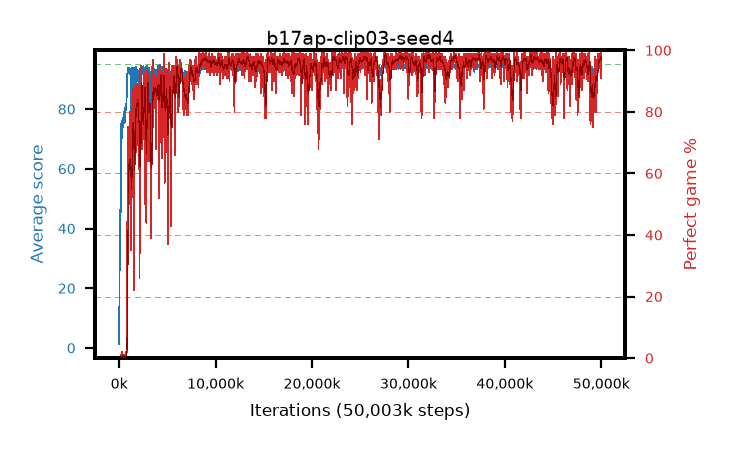

# b17ap-clip03-seed4

step **50,003,968** · 3052 evals · trailing **94.34** · peak **94.58** @39,387,136 · sef **93.5** · best30 **98.0** @32,194,560

## Config

| | |
|---|---|
| algo | ppo |
| collect_envs | 128 |
| discount | 0.99 |
| eval_interval | 16384 |
| eval_queue | True |
| eval_queue_depth | 16 |
| eval_workers | 8 |
| fc_layers | (320,) |
| graph_eval_episodes | 100 |
| max_steps | 50003968 |
| min_checkpoint_score | 40.0 |
| ppo_adam_epsilon | 1e-07 |
| ppo_anneal_fraction | 1.0 |
| ppo_clip | 0.3 |
| ppo_clip_final | None |
| ppo_entropy_coef | 0.01 |
| ppo_entropy_coef_final | None |
| ppo_epochs | 4 |
| ppo_gae_lambda | 0.98 |
| ppo_gradient_clipping | 0.5 |
| ppo_horizon | 33.6 |
| ppo_learning_rate | 0.0003 |
| ppo_learning_rate_final | None |
| ppo_minibatch | 256 |
| ppo_normalize_adv | True |
| ppo_rollout | 128 |
| ppo_target_kl | 0.0 |
| ppo_transitions_per_rollout | 16384 |
| ppo_value_loss | huber |
| ppo_vf_coef | 0.5 |
| seed | 4 |
| torch_threads | 1 |

## Evals

| step | avg score | trailing avg | min score | max score | avg reward | perfect % | epsilon |
|---|---|---|---|---|---|---|---|
| 16384 | 1.28 | 1.28 | 0.0 | 6.0 | -0.493 | 0.0 |  |
| 32768 | 22.26 | 11.77 | 2.0 | 41.0 | 17.23 | 0.0 |  |
| 49152 | 27.68 | 17.07 | 9.0 | 53.0 | 22.649 | 0.0 |  |
| ... | ... | ... | ... | ... | ... | ... | ... |
| 49823744 | 94.32 | 94.09 | 62.0 | 95.0 | 188.026 | 95.0 |  |
| 49840128 | 94.62 | 94.07 | 57.0 | 95.0 | 192.326 | 99.0 |  |
| 49856512 | 94.1 | 94.08 | 60.0 | 95.0 | 188.776 | 96.0 |  |
| 49872896 | 93.81 | 94.04 | 26.0 | 95.0 | 189.534 | 97.0 |  |
| 49889280 | 94.71 | 94.1 | 68.0 | 95.0 | 191.424 | 98.0 |  |
| 49905664 | 94.46 | 94.12 | 68.0 | 95.0 | 191.186 | 98.0 |  |
| 49922048 | 94.46 | 94.15 | 57.0 | 95.0 | 190.185 | 97.0 |  |
| 49938432 | 94.92 | 94.29 | 92.0 | 95.0 | 190.633 | 97.0 |  |
| 49954816 | 93.99 | 94.34 | 29.0 | 95.0 | 190.631 | 98.0 |  |
| 49971200 | 95.0 | 94.35 | 95.0 | 95.0 | 193.708 | 100.0 |  |
| 49987584 | 95.0 | 94.36 | 95.0 | 95.0 | 193.699 | 100.0 |  |
| 50003968 | 93.86 | 94.34 | 60.0 | 95.0 | 183.606 | 91.0 |  |
