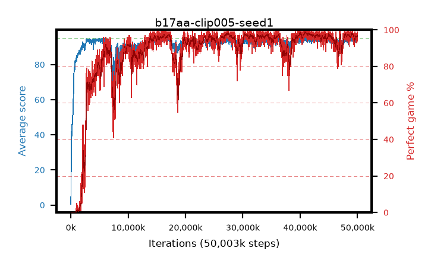

# b17aa-clip005-seed1

step **50,003,968** · 3052 evals · trailing **93.75** · peak **94.44** @41,172,992 · sef **85.3** · best30 **98.4** @41,172,992

## Config

| | |
|---|---|
| algo | ppo |
| collect_envs | 128 |
| discount | 0.99 |
| eval_interval | 16384 |
| eval_queue | True |
| eval_queue_depth | 16 |
| eval_workers | 8 |
| fc_layers | (320,) |
| graph_eval_episodes | 100 |
| max_steps | 50003968 |
| min_checkpoint_score | 40.0 |
| ppo_adam_epsilon | 1e-07 |
| ppo_anneal_fraction | 1.0 |
| ppo_clip | 0.05 |
| ppo_clip_final | None |
| ppo_entropy_coef | 0.01 |
| ppo_entropy_coef_final | None |
| ppo_epochs | 4 |
| ppo_gae_lambda | 0.98 |
| ppo_gradient_clipping | 0.5 |
| ppo_horizon | 33.6 |
| ppo_learning_rate | 0.0003 |
| ppo_learning_rate_final | None |
| ppo_minibatch | 256 |
| ppo_normalize_adv | True |
| ppo_rollout | 128 |
| ppo_target_kl | 0.0 |
| ppo_transitions_per_rollout | 16384 |
| ppo_value_loss | huber |
| ppo_vf_coef | 0.5 |
| seed | 1 |
| torch_threads | 1 |

## Evals

| step | avg score | trailing avg | min score | max score | avg reward | perfect % | epsilon |
|---|---|---|---|---|---|---|---|
| 16384 | 0.51 | 0.51 | 0.0 | 2.0 | -4.498 | 0.0 |  |
| 32768 | 7.52 | 4.01 | 1.0 | 26.0 | 6.347 | 0.0 |  |
| 49152 | 28.05 | 29.13 | 4.0 | 50.0 | 25.531 | 0.0 |  |
| ... | ... | ... | ... | ... | ... | ... | ... |
| 49823744 | 93.5 | 93.72 | 14.0 | 95.0 | 188.227 | 96.0 |  |
| 49840128 | 92.64 | 93.59 | 8.0 | 95.0 | 184.375 | 93.0 |  |
| 49856512 | 93.55 | 93.73 | 18.0 | 95.0 | 189.271 | 97.0 |  |
| 49872896 | 93.3 | 93.7 | 3.0 | 95.0 | 189.019 | 97.0 |  |
| 49889280 | 93.74 | 93.71 | 7.0 | 95.0 | 190.455 | 98.0 |  |
| 49905664 | 93.99 | 93.7 | 22.0 | 95.0 | 190.7 | 98.0 |  |
| 49922048 | 94.77 | 93.63 | 77.0 | 95.0 | 190.483 | 97.0 |  |
| 49938432 | 93.92 | 93.62 | 64.0 | 95.0 | 187.646 | 95.0 |  |
| 49954816 | 94.28 | 93.78 | 60.0 | 95.0 | 189.002 | 96.0 |  |
| 49971200 | 94.9 | 93.88 | 85.0 | 95.0 | 192.609 | 99.0 |  |
| 49987584 | 93.74 | 93.89 | 62.0 | 95.0 | 186.467 | 94.0 |  |
| 50003968 | 94.06 | 93.75 | 3.0 | 95.0 | 190.781 | 98.0 |  |
