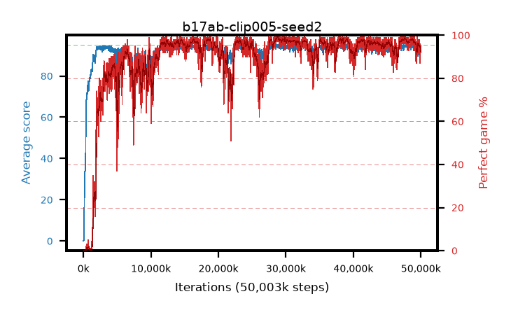

# b17ab-clip005-seed2

step **50,003,968** · 3052 evals · trailing **92.21** · peak **94.56** @28,966,912 · sef **87.4** · best30 **98.7** @28,868,608

## Config

| | |
|---|---|
| algo | ppo |
| collect_envs | 128 |
| discount | 0.99 |
| eval_interval | 16384 |
| eval_queue | True |
| eval_queue_depth | 16 |
| eval_workers | 8 |
| fc_layers | (320,) |
| graph_eval_episodes | 100 |
| max_steps | 50003968 |
| min_checkpoint_score | 40.0 |
| ppo_adam_epsilon | 1e-07 |
| ppo_anneal_fraction | 1.0 |
| ppo_clip | 0.05 |
| ppo_clip_final | None |
| ppo_entropy_coef | 0.01 |
| ppo_entropy_coef_final | None |
| ppo_epochs | 4 |
| ppo_gae_lambda | 0.98 |
| ppo_gradient_clipping | 0.5 |
| ppo_horizon | 33.6 |
| ppo_learning_rate | 0.0003 |
| ppo_learning_rate_final | None |
| ppo_minibatch | 256 |
| ppo_normalize_adv | True |
| ppo_rollout | 128 |
| ppo_target_kl | 0.0 |
| ppo_transitions_per_rollout | 16384 |
| ppo_value_loss | huber |
| ppo_vf_coef | 0.5 |
| seed | 2 |
| torch_threads | 1 |

## Evals

| step | avg score | trailing avg | min score | max score | avg reward | perfect % | epsilon |
|---|---|---|---|---|---|---|---|
| 16384 | 0.07 | 0.07 | 0.0 | 1.0 | -4.931 | 0.0 |  |
| 32768 | 0.13 | 0.1 | 0.0 | 1.0 | -3.67 | 0.0 |  |
| 49152 | 0.51 | 1.26 | 0.0 | 4.0 | -0.308 | 0.0 |  |
| ... | ... | ... | ... | ... | ... | ... | ... |
| 49823744 | 93.0 | 92.62 | 15.0 | 95.0 | 187.717 | 96.0 |  |
| 49840128 | 92.02 | 92.82 | 1.0 | 95.0 | 183.699 | 93.0 |  |
| 49856512 | 89.16 | 92.51 | 1.0 | 95.0 | 179.826 | 92.0 |  |
| 49872896 | 91.71 | 92.42 | 1.0 | 95.0 | 182.387 | 92.0 |  |
| 49889280 | 92.34 | 92.73 | 1.0 | 95.0 | 181.083 | 90.0 |  |
| 49905664 | 87.63 | 92.28 | 1.0 | 95.0 | 173.358 | 87.0 |  |
| 49922048 | 93.21 | 92.73 | 5.0 | 95.0 | 187.885 | 96.0 |  |
| 49938432 | 93.16 | 92.51 | 6.0 | 95.0 | 185.885 | 94.0 |  |
| 49954816 | 91.38 | 92.64 | 1.0 | 95.0 | 182.12 | 92.0 |  |
| 49971200 | 91.22 | 92.4 | 1.0 | 95.0 | 183.912 | 94.0 |  |
| 49987584 | 91.86 | 92.54 | 1.0 | 95.0 | 184.59 | 94.0 |  |
| 50003968 | 91.9 | 92.21 | 3.0 | 95.0 | 183.579 | 93.0 |  |
