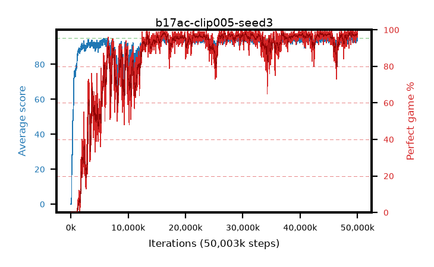

# b17ac-clip005-seed3

step **50,003,968** · 3052 evals · trailing **94.11** · peak **94.36** @16,171,008 · sef **80.8** · best30 **97.9** @16,351,232

## Config

| | |
|---|---|
| algo | ppo |
| collect_envs | 128 |
| discount | 0.99 |
| eval_interval | 16384 |
| eval_queue | True |
| eval_queue_depth | 16 |
| eval_workers | 8 |
| fc_layers | (320,) |
| graph_eval_episodes | 100 |
| max_steps | 50003968 |
| min_checkpoint_score | 40.0 |
| ppo_adam_epsilon | 1e-07 |
| ppo_anneal_fraction | 1.0 |
| ppo_clip | 0.05 |
| ppo_clip_final | None |
| ppo_entropy_coef | 0.01 |
| ppo_entropy_coef_final | None |
| ppo_epochs | 4 |
| ppo_gae_lambda | 0.98 |
| ppo_gradient_clipping | 0.5 |
| ppo_horizon | 33.6 |
| ppo_learning_rate | 0.0003 |
| ppo_learning_rate_final | None |
| ppo_minibatch | 256 |
| ppo_normalize_adv | True |
| ppo_rollout | 128 |
| ppo_target_kl | 0.0 |
| ppo_transitions_per_rollout | 16384 |
| ppo_value_loss | huber |
| ppo_vf_coef | 0.5 |
| seed | 3 |
| torch_threads | 1 |

## Evals

| step | avg score | trailing avg | min score | max score | avg reward | perfect % | epsilon |
|---|---|---|---|---|---|---|---|
| 16384 | 0.0 | 0.0 | 0.0 | 0.0 | -5.001 | 0.0 |  |
| 32768 | 0.01 | 0.01 | 0.0 | 1.0 | -4.991 | 0.0 |  |
| 49152 | 0.02 | 0.01 | 0.0 | 1.0 | -0.619 | 0.0 |  |
| ... | ... | ... | ... | ... | ... | ... | ... |
| 49823744 | 94.83 | 94.07 | 78.0 | 95.0 | 192.555 | 99.0 |  |
| 49840128 | 94.54 | 94.1 | 56.0 | 95.0 | 191.272 | 98.0 |  |
| 49856512 | 94.21 | 94.01 | 67.0 | 95.0 | 189.941 | 97.0 |  |
| 49872896 | 94.08 | 94.03 | 58.0 | 95.0 | 189.813 | 97.0 |  |
| 49889280 | 94.21 | 94.06 | 55.0 | 95.0 | 190.951 | 98.0 |  |
| 49905664 | 94.61 | 94.01 | 72.0 | 95.0 | 191.344 | 98.0 |  |
| 49922048 | 94.29 | 94.09 | 24.0 | 95.0 | 192.017 | 99.0 |  |
| 49938432 | 94.78 | 94.1 | 84.0 | 95.0 | 191.511 | 98.0 |  |
| 49954816 | 95.0 | 94.1 | 95.0 | 95.0 | 193.738 | 100.0 |  |
| 49971200 | 93.56 | 94.12 | 10.0 | 95.0 | 188.294 | 96.0 |  |
| 49987584 | 93.89 | 94.11 | 5.0 | 95.0 | 190.617 | 98.0 |  |
| 50003968 | 93.49 | 94.11 | 3.0 | 95.0 | 189.228 | 97.0 |  |
